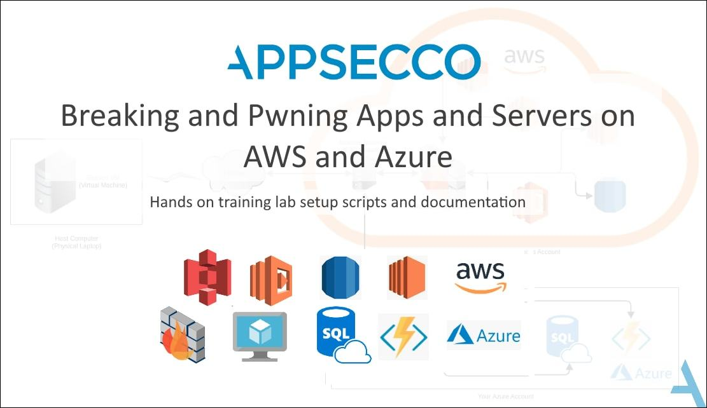

# Breaking and Pwning Apps and Servers on AWS and Azure - Free Training Courseware and Labs

## Introduction

The world is changing right in front of our eyes. The way we have been learning is going to be radically transformed by the time we all have eradicated the COVID19 from our lives.

While we figure out what is the best way to transfer our knowledge to you, we realise that by the time world is out of the lockdown, a cloud focussed pentesting training is likely going to be obsolete in parts.

So as a contribution towards the greater security community, we decided to open source the complete training.

Hope you enjoy this release and come back to us with questions, comments, feedback, new ideas or anything else that you want to let us know! Looking forward to hacking with all of you!

## Description 

Amazon Web Services (AWS) and Azure run the most popular and used cloud infrastructure and boutique of services. There is a need for security testers, Cloud/IT admins and people tasked with the role of DevSecOps to learn on how to effectively attack and test their cloud infrastructure. In this tools and techniques based training we cover attack approaches, creating your attack arsenal in the cloud, distilled deep dive into AWS and Azure services and concepts that should be used for security.

The training covers a multitude of scenarios taken from our vulnerability assessment, penetration testing and OSINT engagements which take the student through the journey of discovery, identification and exploitation of security weaknesses, misconfigurations and poor programming practices that can lead to complete compromise of the cloud infrastructure.

The training is meant to be a hands-on training with guided walkthroughs, scenario based attacks, coverage of tool that can be used for attacking and auditing. Due to the attack, focused nature of the training, not a lot of documentation is around security architecture, defence in depth etc. Additional references are provided in case further reading is required.

To proceed, you will need

1. An AWS account, activated for payments (you should be able to open and view the Services > EC2 page)
2. An Azure account, you should be able to login to the Azure console

## About this repo

This repo contains all the material from our 3 day hands on training that we have delivered at security conferences and to our numerous clients.

The primary things in this repo are:

- `documentation` - all documentation in markdown format that is to be used to go through the training
- `setup-files` - files required to create a `student` virtual machine that will be used to create the cloud labs
- `extras` - any additional files that are relevant during the training

### Getting started

- Clone this repo
- Setup the student VM
- Host the documentation locally using gitbook
- Follow the docs :)

#### Step 1 - Setup the student VM

- the documentation to setup your own student virtual machine, which is required for the training, is under `documentation/setting-up/setup-student-virtual-machine.md`
- this needs to be done first

#### Step 2 - Documentation

- As all documentation is in markdown format, you can use Gitbook to host a local copy while walking through the training

##### Steps to do this

- install gitbook-cli (`npm install gitbook-cli -g`)
- cd into the `documentation` folder
- `gitbook serve`
- browse to `http://localhost:4000`

## License

- Documentation and Gitbook are released under [Creative Commons Attribution Share Alike 4.0 International](CC-BY-SA-LICENSE.txt)
- Lab material including any code, script are release under [MIT License](MIT-LICENSE.txt)

## About Appsecco

At Appsecco we provide advice, testing and training around software, infra, web and mobile apps, especially that are cloud hosted. We also specialise in auditing AWS environments as per the AWS CIS Foundations Benchmark to create a picture of the current state of security in your AWS environment. Our experience has led us to creating multiple hands on training courses like the very popular "Breaking and Pwning Apps and Servers on AWS and Azure" and "Automated Defence using Cloud Services for AWS, Azure and GCP".

* https://appsecco.com
* https://blog.appsecco.com