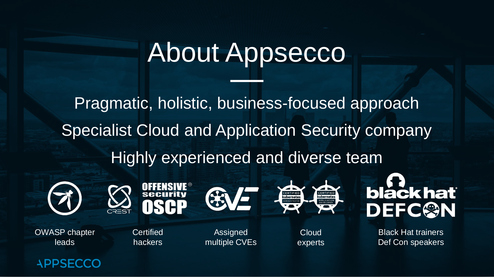

# About Appsecco

Appsecco is a specialist application security company, founded in 2015, with physical presence in London, Bangalore, Doha and Boston, providing industry leading security advice that is firmly grounded in commercial reality.

We work with companies and organisations around the world on a daily basis. Our clients range from major global financial institutions and professional services firms to leading international retailers and retail brands and from large scale, heavy engineering companies to cutting edge technology companies across the globe.

Our services cover the entire software development lifecycle from advising on how to build and foster a culture of security within development teams and organisations to reviewing and advising on the security of applications and associated infrastructure under development to providing rapid response and advice in the event of a security breach or incident. 

The solutions, advice and insight we deliver to our clients always follows three core principles:

1. It must be pragmatic; taking into account the specific commercial, organisational and operational realities of each client individually
2. It must genuinely add value; the advice or solutions we provide must addresses the specific problem a client seeks to solve and have actionable insight to enable them to achieve this
3. Never be purely automated; whenever we are testing for security our reports and output always have significant, expert, human input to give the greatest possible value for our
clients 

In addition to their client-facing work, our technical team are actively involved in researching and developing new and better ways to stay secure and can regularly be found presenting their findings at industry conferences and events ranging from nullcon in India, DevSecCon in London, Boston and Singapore, to Black Hat and DEF CON, the world’s largest security trade show and conferences, respectively, held annually in the USA.