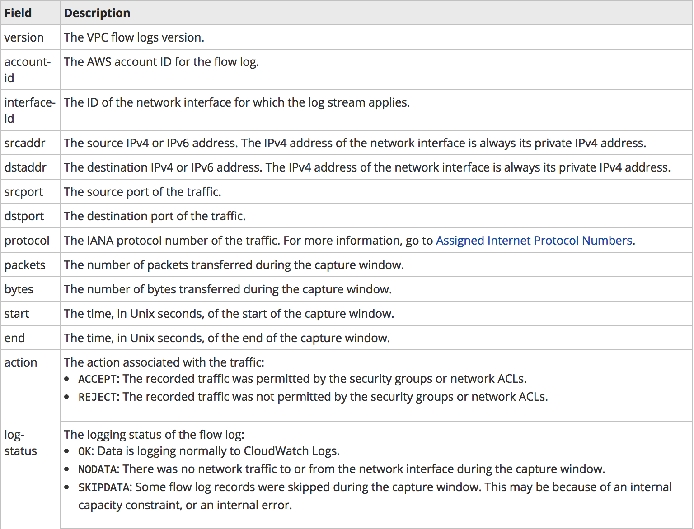

# AWS Flowlogs

VPC Flow Logs is a feature that enables you to capture information about the IP traffic going to and from network interfaces in your VPC.

Flow log data is stored using Amazon CloudWatch Logs. After you've created a flow log, you can view and retrieve its data in Amazon CloudWatch Logs.

## Flow Logs Basics

- You can create a flow log for
  - a VPC
  - a subnet
  - a network interface
- If you create a flow log for a subnet or VPC, each network interface in the VPC or subnet is monitored
- Flow log data is published to a log group in CloudWatch Logs
- Each network interface has a unique log stream
- Log streams contain flow log records, which are log events consisting of fields that describe the traffic for that network interface

### Flow Log Records

    version account-id interface-id srcaddr dstaddr srcport dstport protocol packets bytes start end action log-status

## Steps to setup flow logging

- Go to VPC in AWS console
- Click on the `cloudhackerlab-vpc`
- Select `Flow Logs` from the tab below
- Click on `Create flow logs` button
- In the `Create flow log` page, select `Filter` as `All`
- Select Desitnation to `Send to an S3 bucket`
- Type the ARN of the target bucket for `S3 bucket ARN`. The format is `bucketARN/foldername`

    arn:aws:s3:::lab-UNIQUE-NAME-awscloudsec/flowlogs

- Click on `Create` to setup the flow log

- To generate network traffic, run nmap on the target machine from the attacker machine

    nmap -sV --top-ports 1000 10.0.100.11

- Download the log from the S3 bucket and take a look at the log items
- Download the log files and extract them using `gunzip <file-name>`
- You can read the json file with mousepad or jq (`cat file-name | jq`)

## Additional references

* [Flow Log Records](https://docs.aws.amazon.com/AmazonVPC/latest/UserGuide/flow-logs.html#flow-log-records)
* [Play with flowlogs](https://aws.amazon.com/blogs/security/tag/vpc-flow-logs/)