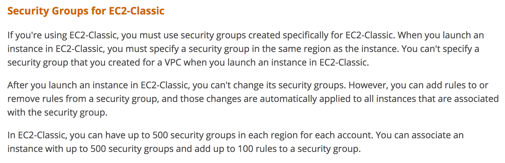
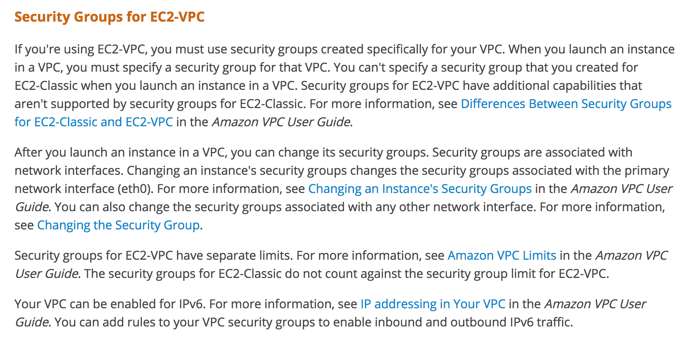
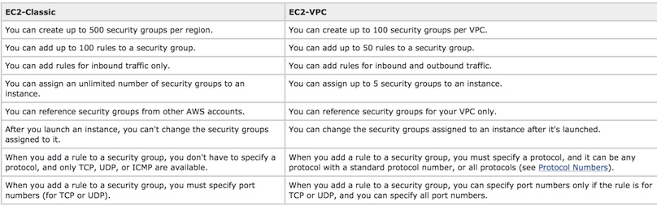

# AWS Security Groups

A security group acts as a virtual firewall for your instance to control inbound and outbound traffic.

When you launch an instance in a VPC, you can assign up to five security groups to the instance. Security groups act at the instance level, not the subnet level.

For each security group, you add rules that control the inbound traffic to instances, and a separate set of rules that control the outbound traffic.

## Security Groups Basics

- Security groups contain `allow` rules
- Basic parts of a security group rule are described below

| Rule Type | Description |
| -- | -- |
| Inbound rule | The source of the traffic and the destination port or port range. The source can be another security group, an IPv4 or IPv6 CIDR block, or a single IPv4 or IPv6 address |
| Outbound rule | The destination for the traffic and the destination port or port range. The destination can be another security group, an IPv4 or IPv6 CIDR block, or a single IPv4 or IPv6 address |
| Standard Protocol Number | Any protocol that has a [standard protocol number](http://www.iana.org/assignments/protocol-numbers/protocol-numbers.xhtml). If you specify ICMP as the protocol, you can specify any or all of the ICMP types and codes |

- All IPv4 addresses need to follow the CIDR notation
  - Single IPv4 address should have `/32` in the end
  - Single IPv6 address should have `/128` in the end

### Security Groups have limits

| Resource | Default Limits | Remarks |
| -- | -- | -- |
| Security groups per VPC (per region) | 500 | Total Security groups per VPCs can't exceed 500 |
| Inbound or outbound rules per security group | 50 | You can have 50 inbound and 50 outbound rules per security group (giving a total of 100 combined inbound and outbound rules) |
| Security groups per network interface | 5 | At max one interface can have 5 security groups by default |

### AWS Security Group EC2 Classic

### AWS Security Group EC2 VPC

## Additional references

- [Securing your VPC using public and private subnets wth network acl](https://cloudacademy.com/amazon-web-services/labs/securing-your-vpc-using-public-and-private-subnets-with-network-acl-27/) - **This lab is free with a trial**
