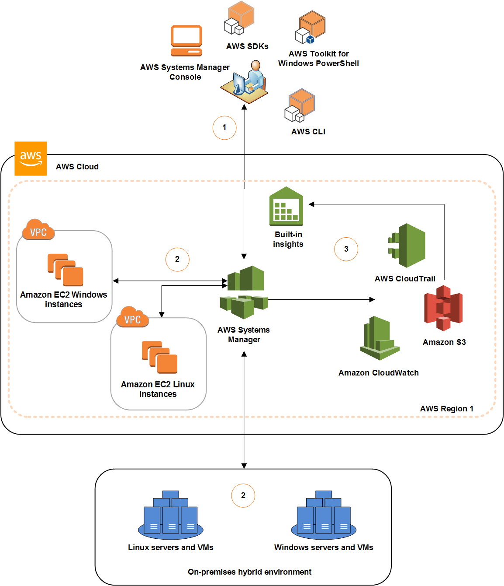

# How SSM Works

## Introduction

This chapter covers a brief introduction to how AWS SSM works and tries to explain the operation using a diagram.

## How SSM works

The following diagram shows a general example of the different processes that Systems Manager performs when executing an action like sending a command to your fleet of servers or performing an inventory of the applications running on your on-premises servers. Each Systems Manager capability, for example Run Command or Maintenance Windows, uses a similar process of set up, execution, processing, and reporting.

1. Configure Systems Manager: Use the Systems Manager console, SDK, AWS CLI, or AWS Toolkit for Windows PowerShell to configure, schedule, automate, and execute actions that you want to perform on your AWS resources.
2. Verification and processing: Systems Manager verifies the configurations, including permissions, and sends requests to the SSM Agent running on your instances or servers in your hybrid environment. SSM Agent performs the specified configuration changes.
3. Reporting: SSM Agent reports the status of the configuration changes and actions to Systems Manager in the AWS cloud. Systems Manager then sends the status to the user and various AWS services, if configured.

## Additional references

- [How SSM works](https://docs.aws.amazon.com/systems-manager/latest/userguide/what-is-systems-manager.html)