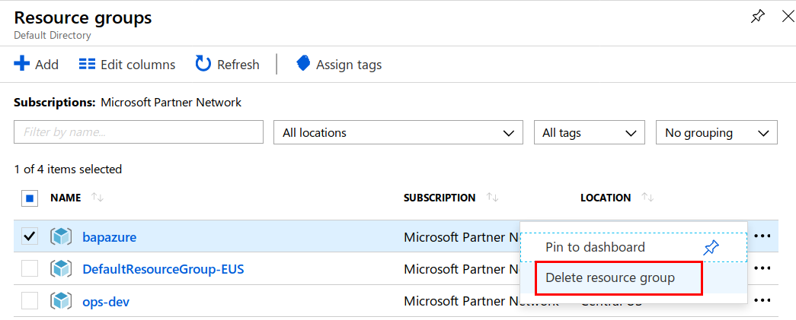

# Deleting Azure Resources

## Introduction

During the course of our training we have created multiple Azure resources. You can continue to work with these resources or choose to terminate them as you will incur some charges if they are kept running.

## What are we going to cover

In this chapter, we will cover the steps required to remove all your Azure assets.

## Steps to complete this

1. Login to the Azure Portal
2. Click on `Resource Groups` from the Favorites menu
3. Select your resource group
4. Click on the 3 dots at the end of the row to bring up a menu
5. Select `Delete resource group`

6. Type the name of your resource group when prompted. This is an additional layer of confirmation
7. Click the `Delete` button

## Additional Resources

None