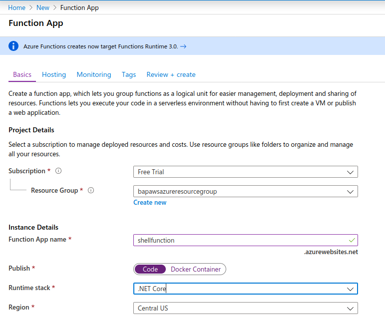
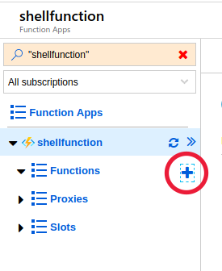
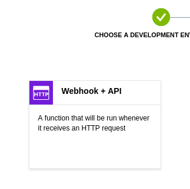
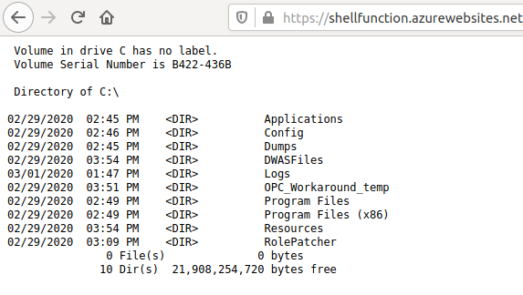

# Azure Functions

## Introduction

Azure Functions is akin to AWS Lambda. This is a compute service that lets you run code without provisioning or managing servers. Azure Functions, essentially are short lived servers that run your function and provide you with output that can be then used in other applications or consumed by other endpoints.

## What are we going to cover?

We will essentially,

- Setup a simple Azure Function
- Execute commands within the Azure Function instance

## Steps to setup a working example

- In the Azure Portal, click on `Create a resource` > `Compute` > `Function App`
- Give the Function App a name. This name needs to be unique across the Internet. You can use your unique-name to proceed.
- Select `Code` under Publish.
- Select Runtime Stack to be `.NET Core`.



- Click `Next: Hosting`
- Ensure Operating System is set to `Windows`
- Ensure Plan type is set to `Consumption`
- Click on `Review + Create` with the rest of the settings left to default.
- Click on `Create` once the Function settings have been reviewed
- A notification alert will let us know if the Function was deployed. Click on `Go to resource` when the notification comes up.
- To see notifications you can also go to `Activity Log` and check if your Function has been setup
- In the Function window click on the + icon next to Functions and click `In-portal`. 



- Click `Continue` and select `Webhook+API` in the next window and click `Create`



- The default code is a 'Hello, World' function. Click on `</> Get function URL` and copy the URL from the modal window.
- Navigate to the URL and pass a `name=Test` GET parameter at the end of the URL to execute the Function.

### Executing server side code to inspect the Azure Function

1. Replace the code in `run.csx` with the following code:

```
#r "Newtonsoft.Json"

using System.Net;
using Microsoft.AspNetCore.Mvc;
using Microsoft.Extensions.Primitives;
using Newtonsoft.Json;

public static async Task<IActionResult> Run(HttpRequest req, ILogger log)
{
    string cmd = req.Query["cmd"];

    string requestBody = await new StreamReader(req.Body).ReadToEndAsync();
    dynamic data = JsonConvert.DeserializeObject(requestBody);
    cmd = cmd ?? data?.cmd;

    System.Diagnostics.ProcessStartInfo procStartInfo = new System.Diagnostics.ProcessStartInfo("cmd", "/c " + cmd);

    procStartInfo.RedirectStandardOutput = true;
    procStartInfo.UseShellExecute = false;
    procStartInfo.CreateNoWindow = true;
    System.Diagnostics.Process proc = new System.Diagnostics.Process();
    proc.StartInfo = procStartInfo;
    proc.Start();
    string result = proc.StandardOutput.ReadToEnd();

    return (ActionResult)new OkObjectResult($"{result}");

}

```
2. Navigate to the Function URL and pass `cmd=dir C:\`


**Note:** The Azure Functions dashboard also provides a console that you can use to Interact with the OS directly. A different system user executes commands in the console then the one that executes through the HTTP Trigger.

### Things to check

The following commands are standard Windows commands that would work across Windows versions and can be used to obtain additional info about the system on which we have gained access. These commands can be used for our Azure Function as well.

- Who are you on the system: `whoami`
- What privileges do you have within the Azure Function: `whoami /priv`
- What operating system is it?: `systeminfo`
- What is the current directory and its contents?: `dir`

Think of other commands to run, essentially you are trying to get an understanding of the environment.

## Addtional References

- [Create your first function in the Azure portal](https://docs.microsoft.com/en-us/azure/azure-functions/functions-create-first-azure-function)
- [How to execute a command in C#](https://www.codeproject.com/Articles/25983/How-to-Execute-a-Command-in-C)