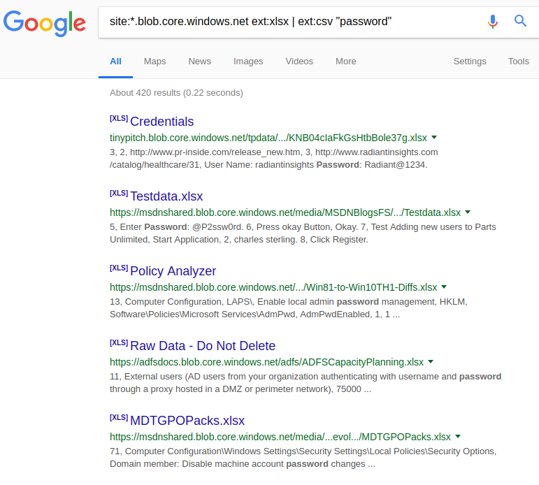

# Attacking Azure Storage Blobs

## Introduction

Azure learnt from the early days of AWS S3 and implemented a secure by default setting for the access permission of objects within. By using the policy of default deny, you have to (just like AWS S3 now) explicitly set access permission for objects and containers.

## What are we going to cover?

This chapter covers some common reconnaissance and attack techniques you can apply to find and work with Azure Blob Storage objects

## Attacking Azure Block Blobs

Let's take a look at some common techniques of identifying open Azure Block Blobs. The interesting thing about Azure Blob Storage's naming convention is that we can use DNS tools to identify if a Blob exists or not based on A records as all Blobs on Azure can be reached using a subdomain of `blob.core.windows.net`

### Using Google to find Azure Blobs

1. Google search for `site:*.blob.core.windows.net`
2. This shows a list of Blob Storage that are deliberately or accidentally configured to be open to the Internet.
3. A specific search query to search for content inside Containers can be made such as the following query `site:*.blob.core.windows.net ext:xlsx | ext:csv "password"`

**Do not click on any search results**



### Using DNS Enumeration

An Azure Blobs path is a FQDN and has an A record that is pointing to a Microsoft owned IP address. Therefore, any subdomain enumeration tool that either checks the existence of the A record for a domain name or checks for HTTP status codes can be used to find Azure Blobs.

We can use a tool like `dnscan` with a sample dictionary to see how this works. Also, for specific engagements, you will need to create custom dictionaries based on the target, the products or services they sell etc.

On the attacker machine, clone the `dnscan` repo:

```
git clone https://github.com/rbsec/dnscan.git
cd dnscan
pip install -r requirements.txt
```

1. Run the following command to use `dnscan` to identify Azure Blob names from the top 100 most common subdomain names

`python dnscan.py -d blob.core.windows.net -w subdomains-100.txt`

Remember, the dictionary we used is a generic one. To obtain better results we will need to append/prepend/edit the names in here.

### Using HTTP Headers

In cases where the blob location is mapped to a CNAME then either looking at the DNS records or the HTTP Headers will tell us that we are looking at a Azure Blob.

1. Run the following command to see the headers for a valid blob name. You can try this with your own blob names

`curl -I https://testazurebucket.blob.core.windows.net/`

2. For a valid blob name but no container/file, a HTTP response as shown below is recieved

```
HTTP/1.1 400 Value for one of the query parameters specified in the request URI is invalid.
Transfer-Encoding: chunked
Server: Microsoft-HTTPAPI/2.0
x-ms-request-id: 22b2aa6a-901e-0098-1390-6a152e000000
Date: Tue, 23 Oct 2018 05:21:43 GMT
```

2. The `Server` header is different when fetching an existing resource in a container. Run the following command and see the `Server` header

`curl -I https://testazurebucket.blob.core.windows.net/testcontainer/moon.jpg`

```
HTTP/1.1 200 OK
Content-Length: 6098046
Content-Type: image/jpeg
Last-Modified: Mon, 22 Oct 2018 10:21:11 GMT
Accept-Ranges: bytes
ETag: "0x8D6380816D5BEFE"
Server: Windows-Azure-Blob/1.0 Microsoft-HTTPAPI/2.0
x-ms-request-id: 71bc21e1-a01e-0090-68f9-690e5d000000
x-ms-version: 2014-02-14
x-ms-lease-status: unlocked
x-ms-lease-state: available
x-ms-blob-type: BlockBlob
Date: Mon, 22 Oct 2018 11:21:53 GMT
```