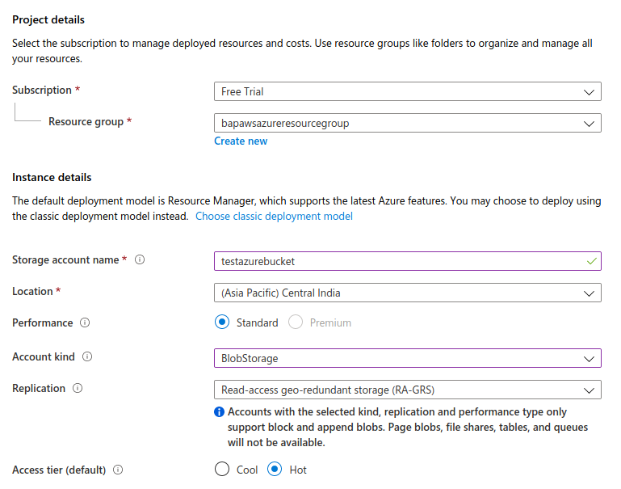
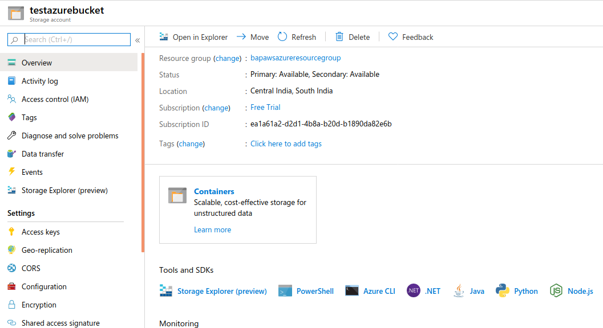
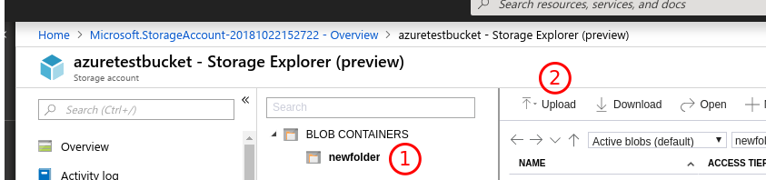

# Azure Storage - Block Blobs

## Introduction

Azure Block Blobs are the equivalent of AWS S3 and allows to store objects. Access to these objects can then be done over HTTP using a URL that is generated.

## What are we going to cover?

We will look at

- misconfigurations with Azure Block Blobs (AWS S3 equivalent)

## Steps to Setup a Azure Block Blob

Create a new Blob Storage object using the following steps

1. Click on `Storage Account` from the favorites menu and click `Create storage account` or the `+ Add` button.
2. Provide a unique storage account name. For example `azuretestbucket`. This has to be unique across the Internet. So you can use your unique-name to proceed.
3. Under account kind select `BlobStorage` from the drop down.
4. Leave all the remaining options at default

1. Click `Next: Networking` and let the default `Public endpoint (all networks)`
2. Click `Next:Advanced`. Do not change anything here. Click on `Review + Create`
3. Click `Create` after validation is successful, to setup your Azure Block Blob.
4. Click on `Go to resource`

9. Under `Settings`, click on `Properties` and copy the `PRIMARY BLOB SERVICE ENDPOINT`. For `azuretestbucket`, it will be `https://azuretestbucket.blob.core.windows.net/`

## Adding data to the Blob

To add data to the Blob, a container inside the Blob must be created. This can be done via the Storage Explorer.

Azure Storage can also be managed using an external Storage manager (download link in references).

We will use the portal to upload and manage data to our Blob.

1. Click on `Storage Explorer` in the left pane of the Storage account.
2. Right click on `BLOB CONTAINERS` and select `Create Blob Container`.
3. Give it a name and set the `Public access level` to `Container (annonymous read access for containers and blobs)`
4. Click on the newly created container and select `Upload` on the container menu
   

1. Select a file (non-sensitive).
2. Under Advanced, make sure the `Account key` toggle button is selected
3. Select `Blob type` to `Block blob`
4. Click `Upload`
5. Once Upload is completed, click on the object that was uploaded and click on `Copy URL`
6.  Navigate to the URL to view the object.

## To generate a signed URL

1. Right click on the uploaded object and select `Get Shared Access Signature (SAS)`
2. You can enable the `DELETE` permission as well.
3. To access the uploaded file using the SAS browse to the SAS URL created.
4. To delete the object, use `curl -X DELETE https://SAS-URL-HERE`

## Additional References

- [Creating a Blob and uploading content to it](https://docs.microsoft.com/en-us/azure/storage/blobs/storage-quickstart-blobs-portal)
- [Azure Storage Explorer](https://azure.microsoft.com/en-in/features/storage-explorer/)
- [Understanding Block Blobs, Append Blobs, and Page Blobs](https://docs.microsoft.com/en-us/rest/api/storageservices/understanding-block-blobs--append-blobs--and-page-blobs)