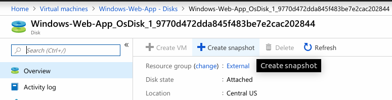
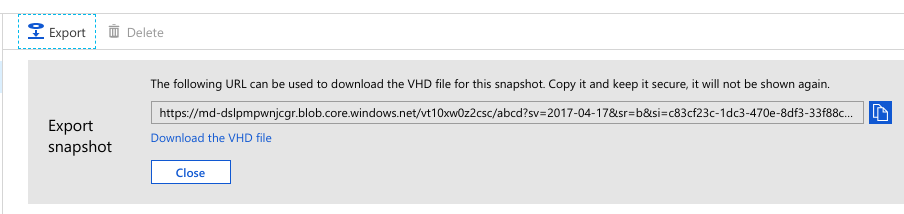
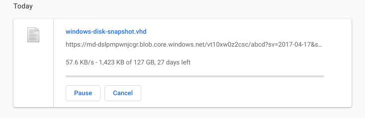
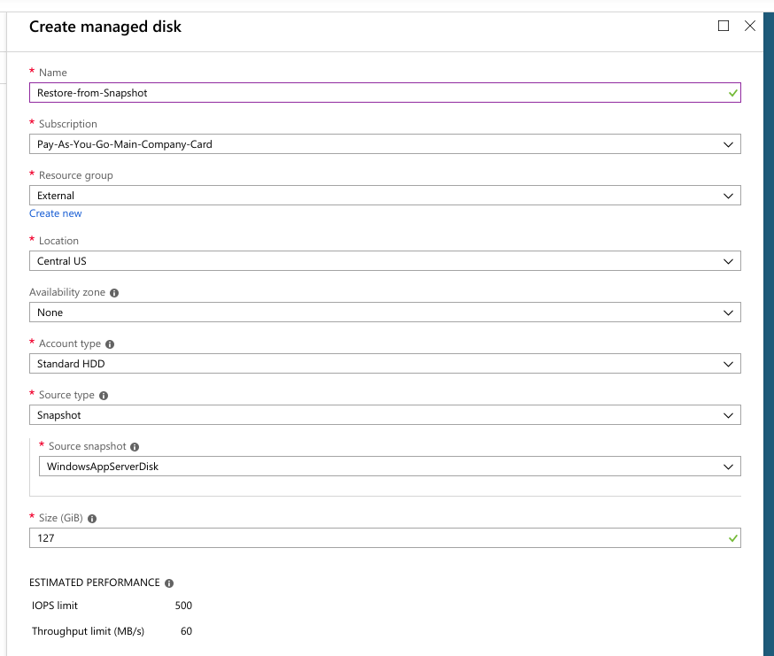
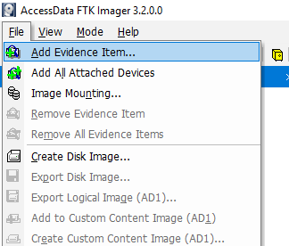
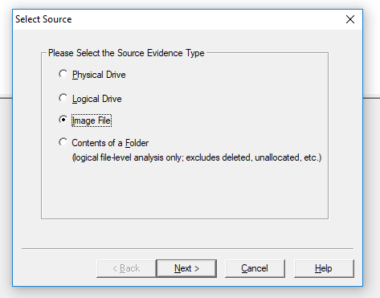
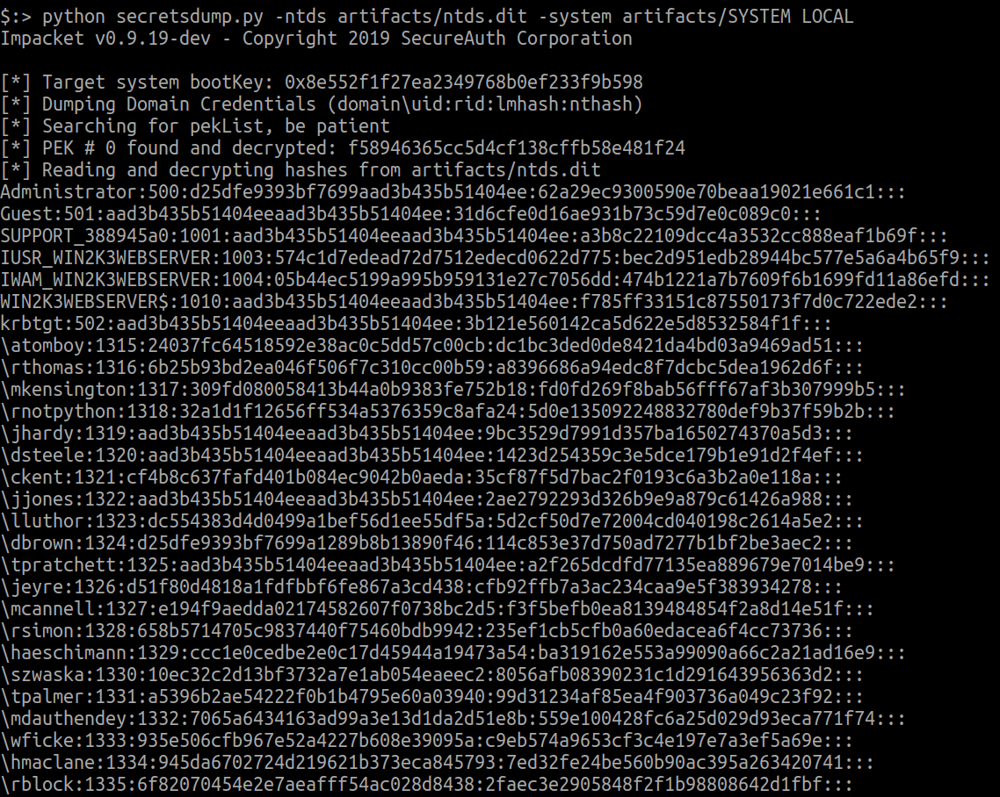

# Cloud Forensics for Windows disks in Azure

## Introduction

Azure allows you to take disk snapshots that can then be attached to another Virtual machine for forensics on the secondary disk. As an alternative, disk snapshots can be downloaded or moved to a blob storage for distribution/download by another Azure account.

## What are we going to cover?

This chapter will introduce to you a popular tool that can be used to work with offline disks and walk through a common technique that attackers use to extract credentials from offline disks.

**This is a demo chapter. The trainer will run you through the steps on screen.**

## Steps to attack

### Taking a snapshot of an Azure disk for analysis

To create a snapshot of a disk attached to an Azure Virtual Machine

- Click on the VM and select the disk
- In the disk pane, select `Create Snapshot`



- Select a resource group and give the snapshot and name
- Click the `Create` button
- To see the snapshot, either click on notifications and select the snapshot notification or search Snapshots in the search bar for Azure

Once the snapshot is created, you can choose to attach it to another Virtual machine and investigate it or download it for offline analysis.

- To download the snapshot, goto `Snapshots` in Azure
- Select your snapshot and click Export. You will be presented to generate a short lived link to download the snapshot for offline analysis.



- Remember, the size of the snapshot will be the same as the attached disk which can be quite intensive to download and store depending on the size. For Standard HDD, the disk will be 127 GiB.



To attach a snapshot to an existing VM

- Create a managed disk out of the snapshot by going to Disks and select the snapshot from the `source` dropdown



- Once the disk is created, you can add the disk as a data disk to an existing VM by selecting Disks for a VM

### Tools for analysis (DEMO)

To examine the artifacts on a Windows disk, even if the boot record or MFT is corrupted, you can attach it as an image file to a forensic tool like FTK Imager.

- Open FTK Imager and click on Add Evidence Item



- Select the VHD downloaded. We have used a sample of another disk to show the steps as they remain the same.



- Once the image file is loaded, it can be browsed for artifacts as the filesystem becomes readable


### Extracting User hashes and credentials from a Domain Controller

The following is an example of performing forensic artifact extraction from a Windows Domain controller. Using the right tools, the user data and hashed credentials can be extracted from the Active Directory.

As an attacker these can be used to perform replay attacks, cracking weak hashes to attack password reuse or simply identify usernames for phishing etc.

- Using FTK imager, obtain the following 2 files required to extract credentials from a Windows Domain Controller

    a. Primary database of credentials and all domain data - `C:\Windows\System32\NTDS\ntds.dit`

    b. Windows Registry System Hive containing the Boot Key to decrypt user data from NTDS - `C:\Windows\System32\Config\SYSTEM`

Once these files are extracted, you can use the very popular (and extremely useful) suite of tools called `impacket`. For this usecase, the tool in the examples directory called `secretsdump.py` will be used.

Run the following command to dump all credentials from the AD database file

```
python secretsdump.py -ntds ntds.dit -system SYSTEM LOCAL
```



## Additional references
- [Create a snapshot of VHD in Azure](https://docs.microsoft.com/hi-in/azure/virtual-machines/windows/snapshot-copy-managed-disk)
- [Creating and restoring snapshots using commandline](https://www.francoisdelport.com/2017/12/creating-and-restoring-azure-virtual-machine-snapshots-for-managed-disks/)
- [impacket on Github](https://github.com/SecureAuthCorp/impacket)
- [secretsdump.py and Windows AD attacks](https://github.com/swisskyrepo/PayloadsAllTheThings/blob/master/Methodology%20and%20Resources/Active%20Directory%20Attack.md) 
