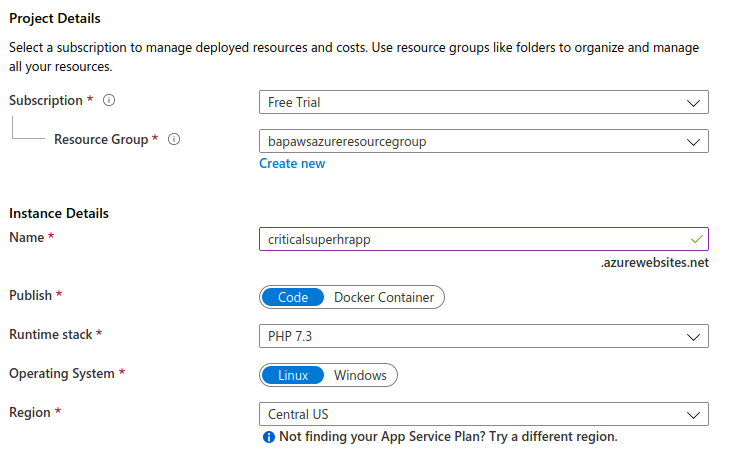
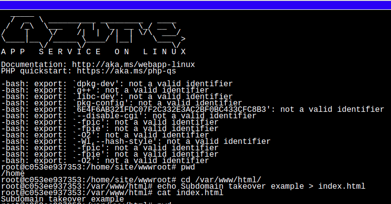
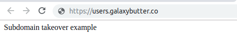

# Azure App Services and Subdomain Takeovers

## Introduction

Azure Web Apps enables you to build and host web applications in the programming language of your choice without managing infrastructure. It offers auto-scaling and high availability, supports both Windows and Linux, and enables automated deployments from GitHub, Azure DevOps, or any Git repo.

## What are we going to cover?

We will look at how we can

- Identify a domain belonging to a target that is vulnerable to a subdomain takeover
- Use the information we collect to create an Azure App Service to take over the subdomain

**Please note:** This chapter requires the existence of CNAMES that do not point to anything (dangling CNAMES). Best to read through this chapter as we will not be able to create CNAMES for everyone trying is exercise outisde a classroom setting. Take a look at the references at the bottom of this page for a real world example.

## Steps to Identify a vulnerable subdomain

The following steps can be used to identify a subdomain that is potentially vulnerable to a subdomain takeover

1. Our target domain is `galaxybutter.co`.
2. While doing reconnaissance, a sub domain was discovered, `users.galaxybutter.co`
3. Browse to this sub domain at `https://users.galaxybutter.co` and notice the error
4. Perform a DNS A query to identify the IP address of this sub domain using `dig A users.galaxybutter.co`. Notice the NXDOMAIN response. This means that there is no such domain.
5. Perform a DNS CNAME lookup using `dig CNAME users.galaxybutter.co`
6. The CNAME points to an Azure App Service that was probably deprecated/removed
7. An attacker can now create an Azure App service with the same name and host phishing content, resulting in a sub domain takeover

## Steps to create an App Service

We will work in groups for this.

### Steps to hijack the sub domain

This is essentially two steps from here

1. Configure the App Service name to point to the subdomain
2. Add custom content to the site to show its been taken over

### Creat an App Service and point it to the missing CNAME

1. In the Azure Portal, click on `All Services` and search for `App Services`.
2. Click on `Add` and select the most basic app from the Web window that opens.
3. Click on `Create`.
4. Provide the App name as `XXXXXXXXXX`. Replace `XXXXXXXXXX` with your team name. The App will be hosted at `XXXXXXXXXX.azurewebsites.net`
5. Select Runtime Stack as PHP 7.3. Any stack could be chosen here, but since our objective is to show subdomain takeover, it doesn't really matter for this Proof of Concept.
6. Under `Sku and size` select `Dev/Test > F1`
7. Click `Create`. If you receive an error, check the raw message's bottom most json body.

6. Once the App Service is created, go to its dashboard and under `Overview` click on `Browse` to see the deployment.

#### Add a custom domain to the App Service

1. In the dashboard, scroll down to find `Custom domains`
2. Click on `Add hostname` and type `XXXXXXXXXX.galaxybutter.co`. Replace `XXXXXXXXXX` with your team name.
3. Click on `Validate`
4. Click on `Add hostname` to complete the configuration
5. Reload `https://XXXXXXXXXX.galaxybutter.co` and check if the takeover is complete.

#### Show custom content

1. A deployment of a web application in the Azure App Service is beyond the scope of this training, however to show a Proof of Concept, we can simply update the index page shown when you browse to `https://XXXXXXXXXX.galaxybutter.co`
2. In the dashboard of the App Service, scroll down and click on `SSH`. Click on Go to launch the SSH shell for the App Service container.
3. Navigate to the `/var/www/html` folder and run the following command to create a simple file containing our text
`echo Subdomain takeover example. > index.html`

4. Reload the sub domain URL to see your message.

## Finding Subdomain takeover at scale using FDNS Dataset (DEMO)

Forward DNS dataset is published as part of Project Sonar. This data is created by extracting domain names from a number of sources and then sending DNS queries for each domain. The data format is a gzip-compressed JSON file. We can parse the dataset to find sub-domains for a given domain. 

The project also publishes CNAME records they have enumerated across the Internet. We can use this CNAME dataset to identify potential subdomain takeover issues across the Internet.

https://opendata.rapid7.com/sonar.fdns_v2/

**Find Azure Websites using FDNS dataset**

    cat CNAME-DATASET-NAME | pigz -dc | grep -E "\.azurewebsites\.com"

**Find AWS S3 based applications using FDNS dataset**

    cat CNAME-DATASET-NAME | pigz -dc | grep -E "\.s3\.amazonaws\.com"

## Additional References

- [Can I take over](https://github.com/EdOverflow/can-i-take-over-xyz)
- [Subdomain Takeover: Starbucks points to Azure](https://0xpatrik.com/subdomain-takeover-starbucks/)