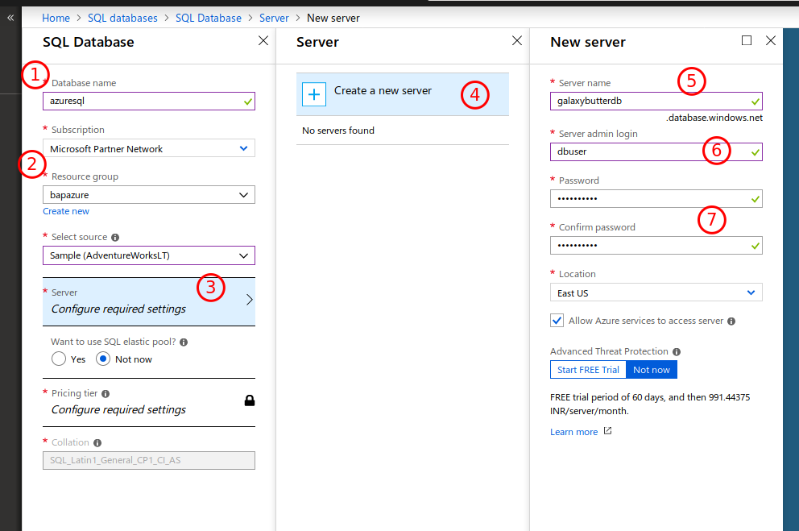

# Azure SQL Databases

## Introduction

Azure SQL Databases offers just as the name suggests, MSSQL Databases hosted in Azure.

## What are we going to cover?

In this chapter we will create MSSQL server and see what queries work and then look at identifying MSSQL servers on the Internet using Google searches

- Creating a Azure SQL Database 
- Using OSINT to identify interesting sql database servers on the Internet

## Steps to Setup a Azure SQL Database server

1. Click on `All services` and type `SQL databases`
2. In the SQL Database dashboard, enter a database name, select a Resource Group and click Server
3. Click on `Create a new server`. This is the server on which MSSQL will run
4. Add a `Server name`. The final server endpoint will be `<servername>.database.windows.net`
5. Enter a server admin login. This is the SQL Identifier and cannot be `root`, `sa`, `admin`, `administrator` etc. Enter `dbuser` here to proceed
6. Enter a password that meets password complexity requirements
7. Click `Select` to confirm the server setup
8. Select the `Configure database` and choose Basic. Click `Create` to start the setup



### Interacting with the SQL Server

1. Once the server is created, click on `Query Editor (preview)` and login using the credentials that were set for the server
2. Run common SQL queries here which as attackers are normally run to examine a MSSQL server
    - `SELECT @@version;`
    - `select @@servername;`
    - `SELECT name FROM master..sysdatabases;`
    - `SELECT name, password_hash FROM master.sys.sql_logins;`
3. MSSQL server (non Azure versions) allow administrators to run Operating System commands using an extended stored procedure called `xp_cmdshell`
4. This is not available in Azure SQL DB alongwith several other variables and stored procedures that can be used to access information about the underlying operating system.

## OSINT to find interesting Azure SQL Databases

1. The Azure SQL database server endpoint name will be of the form `??.database.windows.net`
2. Performing searches on the Interenet for this particular string can yield interesting results. Essentially, database endpoint names and potential credentials can be found by using Google to search for:

```
"database.windows.net" site:pastebin.com
```

## Additional references

- [Create a Azure SQL Server](https://docs.microsoft.com/en-us/azure/sql-database/sql-database-get-started-portal)
- [XP cmdshell](https://docs.microsoft.com/en-us/sql/relational-databases/system-stored-procedures/xp-cmdshell-transact-sql?view=sql-server-2017)
- [Global variables in SQL Server](https://code.msdn.microsoft.com/Global-Variables-in-SQL-749688ef)