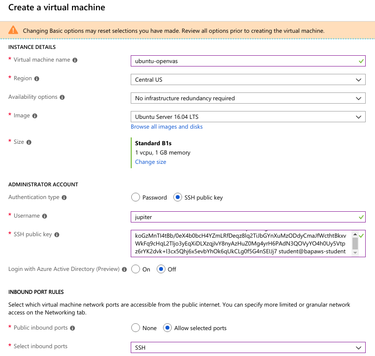
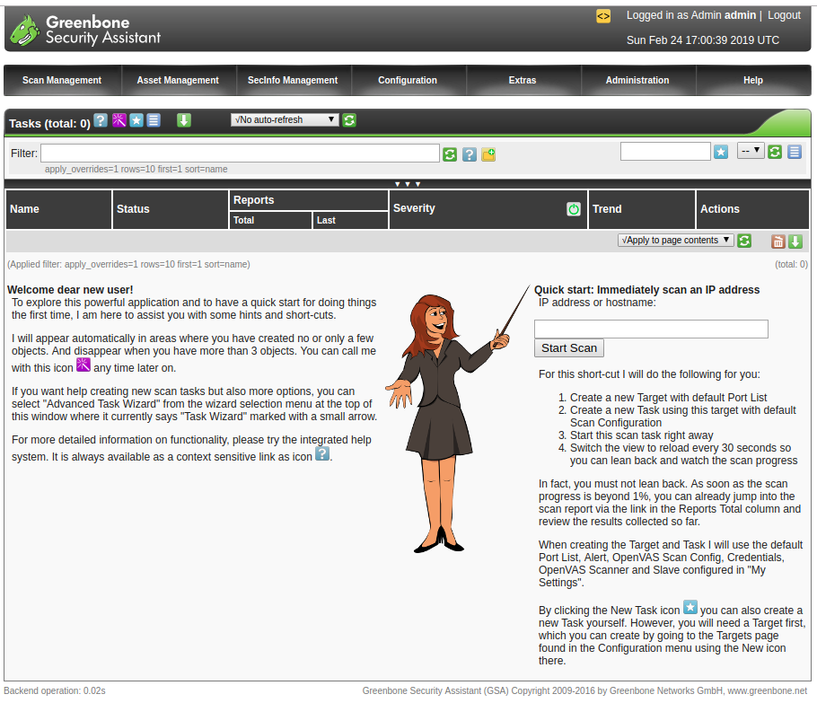

# Setting up OpenVAS

## Introduction

**This is a reference chapter. This is already setup for the students. The credentials will be provided in class for students to login and look around OpenVAS.**

OpenVAS (Open Vulnerability Assessment System, originally known as GNessUs) is a software framework of several services and tools offering vulnerability scanning and vulnerability management. OpenVAS is now officially called Greenbone Security Assistant but is still widely referred to as OpenVAS.

All OpenVAS products are free software, and most components are licensed under the GNU General Public License (GPL). Plugins for OpenVAS are written in the Nessus Attack Scripting Language, NASL.

Its capabilities include unauthenticated testing, authenticated testing, various high level and low level Internet and industrial protocols, performance tuning for large-scale scans and a powerful internal programming language to implement any type of vulnerability test.

The scanner is accompanied by a vulnerability tests feed with a long history and daily updates.

## What are we going to cover?

This chapter covers setting up OpenVAS on a Ubuntu 16.04 machine on Azure, to scan the other machines in the network.

Although, the setup is covered on Azure, this is easily replicated on AWS, GCP or on a local machine.

## Steps to setup (**ONLY REFERENCE. DO NOT DO THESE STEPS.**)

- Create a new Ubuntu 16.04 machine in Azure
- Add the cloudhacker public key as a login mechanism. The cloudhacker public key can be obtained by running the `cat ~/.ssh/id_rsa.pub` command on the student machine



- Once the machine is up, SSH into the machine from the attacker machine as the private key is already added to the SSH authentication agent

`ssh -l <USERNAME> <AZURE-UBUNTU-OPENVAS-IP>`

- Install docker on the Ubuntu machine by following the instructions at `https://www.digitalocean.com/community/tutorials/how-to-install-and-use-docker-on-ubuntu-16-04`

- Once docker is setup, pull the OpenVAS docker container from docker hub. We will set it up to expose the web console on port 443, to always restart if it stops and to mount a local data directory as the OpenVAS data directory

`docker run -d -p 443:443 --restart always -e OV_PASSWORD=JumboDeltaPolish@1 -v $(pwd)/data:/var/lib/openvas/mgr/ --name openvas mikesplain/openvas`

- Once the docker is running, we exec into it and update OpenVAS plugins

```
docker exec -it openvas bash
## inside container
greenbone-nvt-sync
openvasmd --rebuild --progress
greenbone-certdata-sync
greenbone-scapdata-sync
openvasmd --update --verbose --progress

/etc/init.d/openvas-manager restart
/etc/init.d/openvas-scanner restart
```

- This docker version of OpenVAS requires the host header to be set to openvas. You can do this by adding the following line at the end of the `/etc/hosts` file in the student machine.

`137.117.148.84 openvas`

The IP where this is deployed currently is `137.117.148.84`

- Once the database is up-to-date, open your web browser and type the URL `https://openvas/login/login.html`. On the login page, provide the username and password. After logging in, you will be presented with the OpenVAS dashboard.

- Credentials to login:

```
admin
JumboDeltaPolish@1
```

- You may have to allow port 443 through the Azure Network Security Group



## Additional References

- [OpenVAS Website](http://openvas.org/)