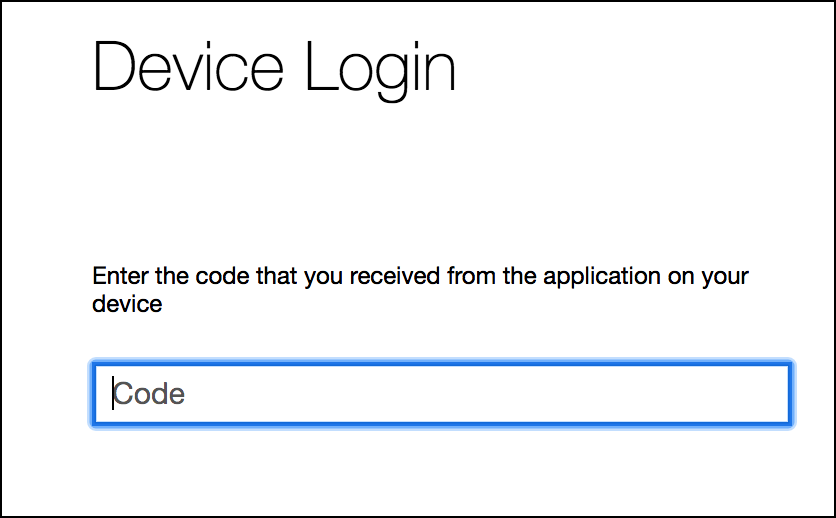
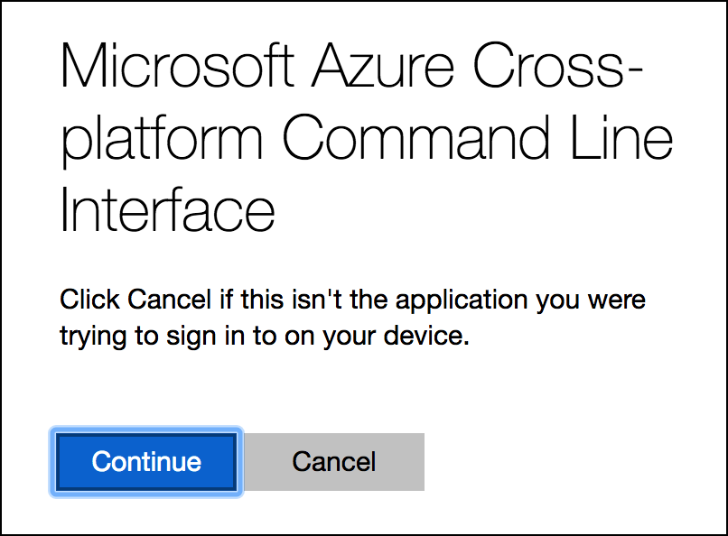
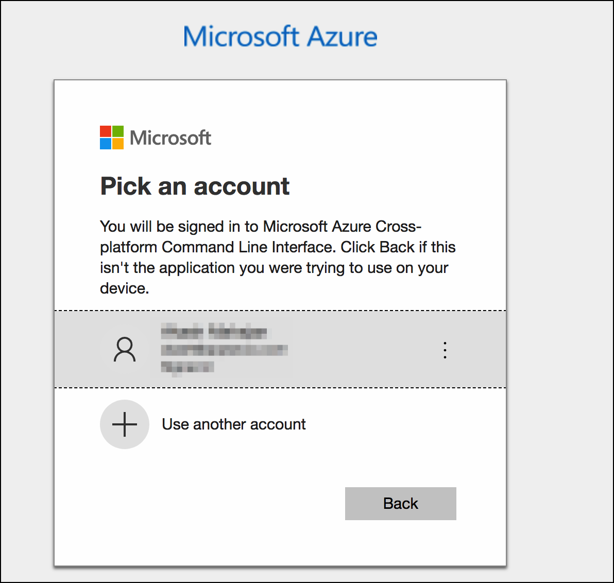
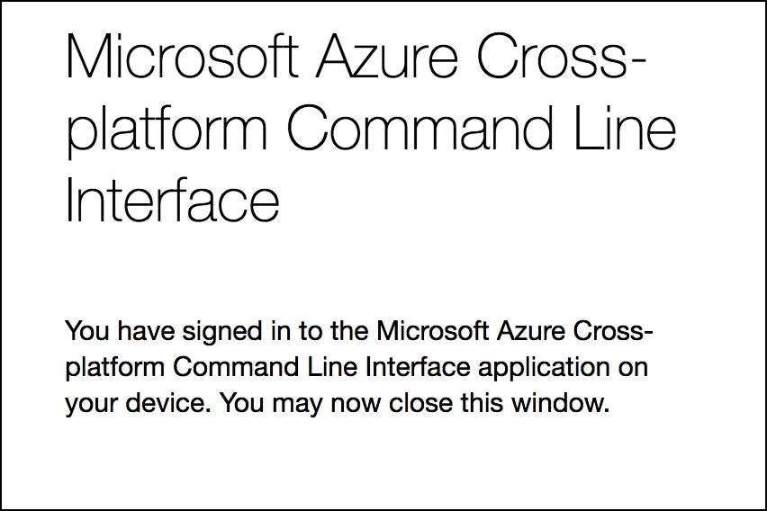
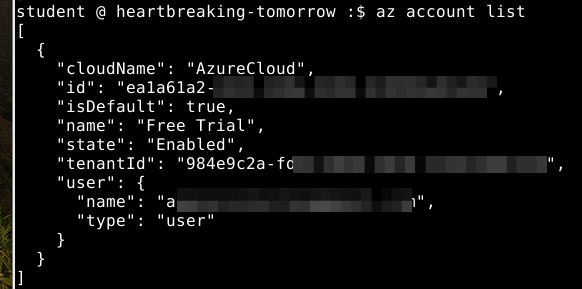

# Getting Started with Azure CLI

This chapter is to login to the Azure CLI from your student machine as you may not want to use the Azure Cloud shell all the time.

## Login to the Azure CLI on the student machine

First check if you are already logged in

```bash
az account list
```

If you aren't logged in, you should get this output.

```bash
Please run "az login" to access your accounts.
[]
```

Now that we know we don't have Azure account setup, we can use the following command to begin. The `--use-device-code` parameter is used to generate a code that can be used to authenticate with the web backend

```bash
az login --use-device-code
```

We will get something like this

```bash
To sign in, use a web browser to open the page https://microsoft.com/devicelogin and enter the code XXXXXXX to authenticate.
```

> Note the code XXXXXXX mentioned.

Browse to the URL and enter the code when asked.



Confirm by clicking on Continue



Select your account



Web page will confirmed you are logged in



Switch back to the window where you typed the `az login` command



Note the `id` from the previous output.

## Once you are logged in

### List the azure account

```bash
az account list
```

**Only if you were already logged in**, get the default Azure account if you have more than one.

```bash
az account list | jq '.[] | select(.isDefault==true) | {subname: .name, username: .user.name}'
```

Set this new account as default

```bash
az account set --subscription <PROVIDE YOUR ID FROM PREVIOUS OUTPUT>
```
