# Getting Started With Azure Portal

The best way to learn about the navigating the Azure Portal is by trying it to solve something for us.

As an example and to get familiar with the Azure Portal, let's create a Ubuntu based Virtual Machine

## Create a Resource Group

From the burger menu, select `Resource Groups` and create a new resource group. You can also use the same resource group that you created in the previous chapter for Azure Cloud shell.

All the services we use can be made to operate within a resource group. This makes it easier to delete the objects all at once instead of independently removing them.

## Creating an Ubuntu based Virtual Machine

Creating a new virtual machine in Azure Portal is all about doing the following

- Choose the base operating system for the virtual machine (VM)
- Choose under which resource group will the VM run
- Fill in the values
  - for region where the VM should spin up
  - select a VM size
  - add a user and SSH key for access
  - open a port to allow SSH access
- Once the VM is created, use the provided information to login

The first step is to start by clicking on resource groups

**In this example, Resource Group name is `bapazure`. Please use the Resource Group name that you have created.**

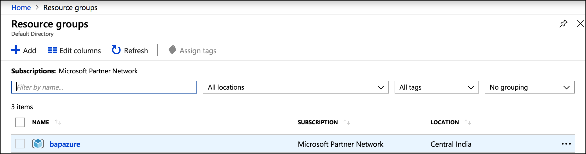

Click on add and type `Ubuntu Server 18.04 LTS`

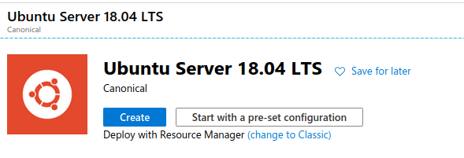

Click the `Create` button at the bottom

### Creating a Virtual machine by filling a form

Fill information about the resource group name in project details

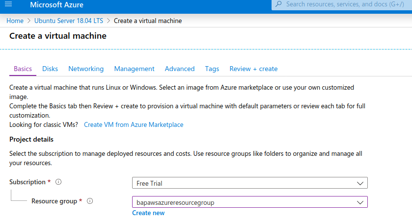

Fill in instance details

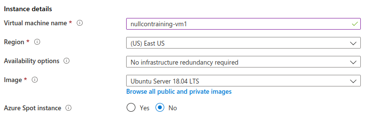

Select a VM size by clicking on `Change Size`. Select `B1s` for now.

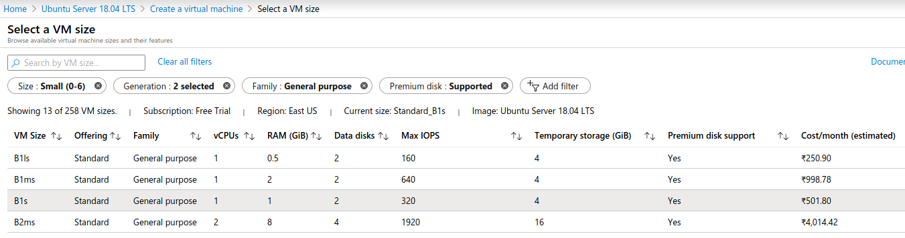

SSH key details. Read the public key from the student VM by `cat ~/.ssh/id_rsa.pub`

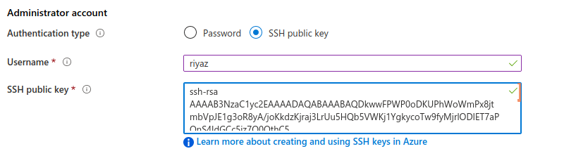

Inbound port information

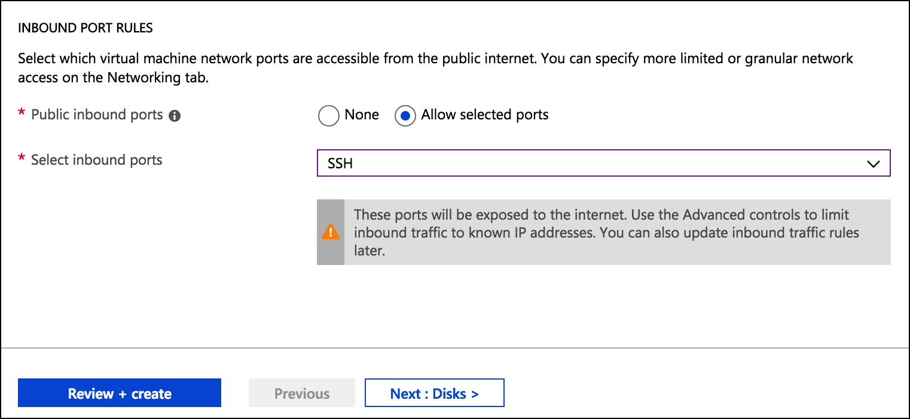

Configuration validated

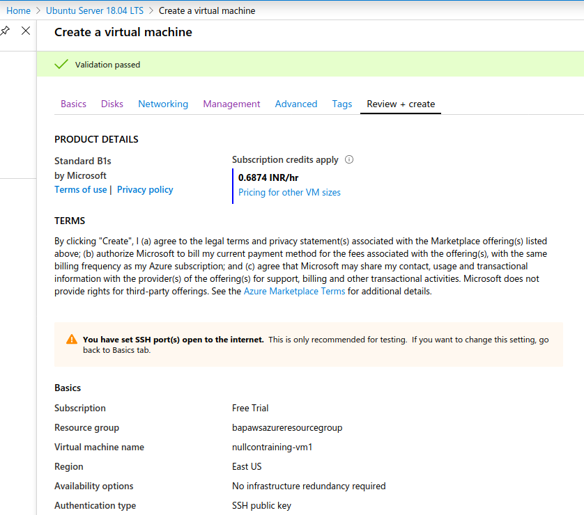

Deployment is underway

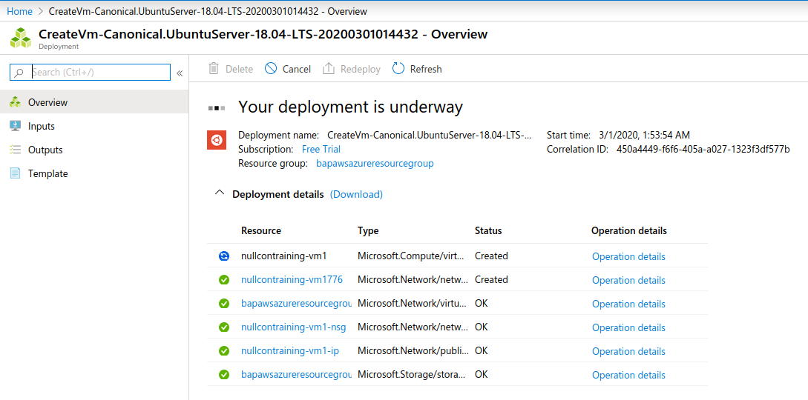

Deployed

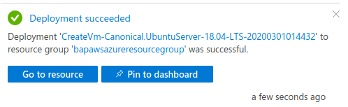

### Connecting to our newly setup virtual machine

Once VM is up, SSH to it

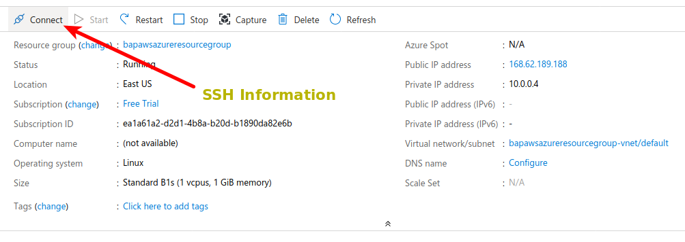

SSH information we need to for connecting. Step 4 is what you need. Your private key is already added to ssh agent on the student machine. Use the command without the `-i` flag else to follow the screen, the private key is the `~/.ssh/id_rsa` file on the student machine.

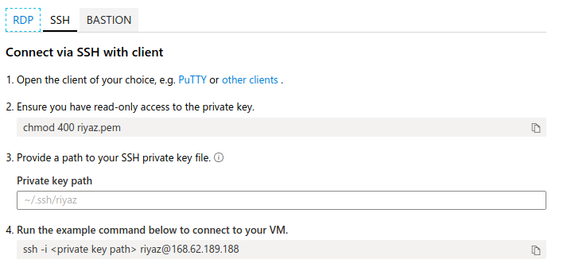

A complete Ubuntu Server setup on the internet for our use in less than 5 minutes

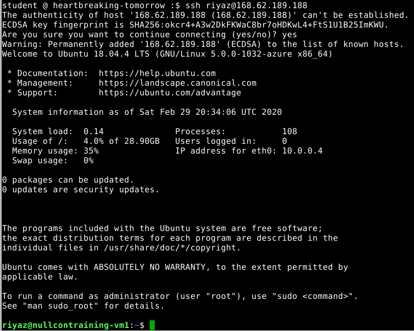

## Additional Exercise

As an exercise to continue practising after the training, attempt to do the following

1. Configure the Azure Virtual Machine's firewall to allow SSH access only from the attacker machine
2. Make a copy of the private key from the student machine's `~/.ssh/id_rsa` folder or add a new public key to the Azure virtual machine
3. Verify that the Azure Virtual Machine firewall allows access as per the rules you have defined
