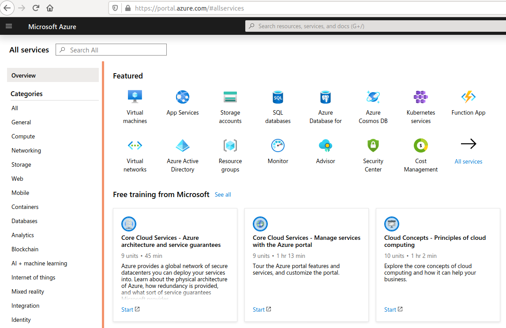
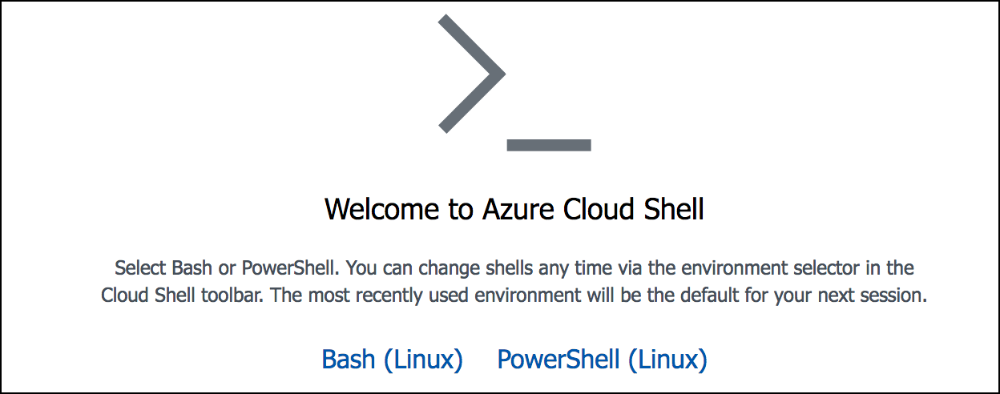
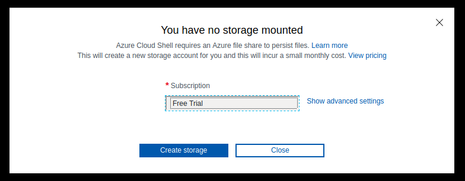
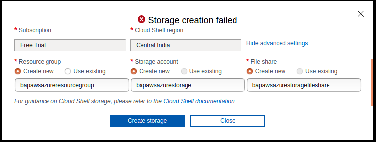
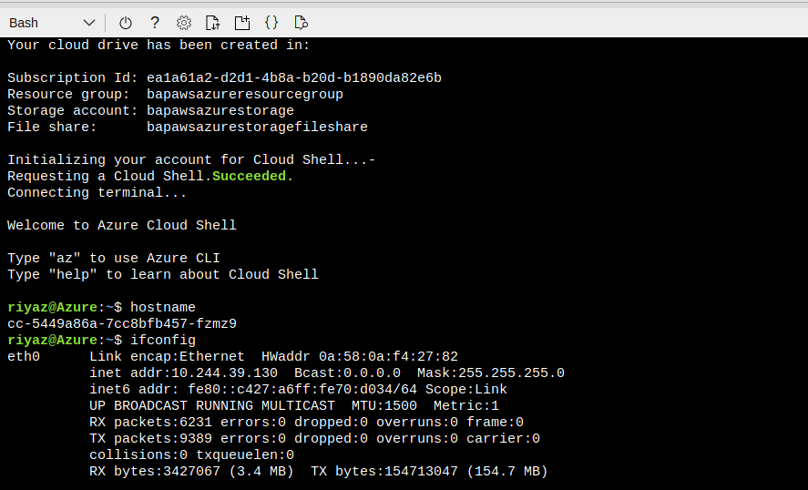

# Software required

Primarily we will be using and interacting with the Azure cloud through the portal, Azure CLI and Azure Cloud Shell.

## Azure Portal

Browse to [portal.azure.com](https://portal.azure.com) and login with the account you are using for Azure access.



## Azure Cloud Shell

Once you are logged in to the [Azure portal](https://portal.azure.com) you can click the SHELL icon present in the top menu bar to access the Azure Cloud Shell.


You have an option of choosing between [Azure PowerShell](https://docs.microsoft.com/en-us/powershell/azure/overview?view=azurermps-6.10.0) and [Azure CLI Bash](https://docs.microsoft.com/en-gb/cli/azure/?view=azure-cli-latest).



The main difference is that Azure CLI was written to be cross-platform from the beginning and Azure Powershell can be installed on any system that supports .NET Standard and .NET Core.

> For the duration of this training, we will be using the portal and Azure CLI.

### Enable Storage for Azure Cloud Shell

As you have a new account, you will be using the Free Credits that Microsoft has provided you. If you are using a different subscription type, you will see that in bottom pane when starting an Azure cloud shell in the browser.



Click on Show Advanced Settings and add some values for the configuration and click on Create



Once the shell and the Azure CLI environment is setup, you should recieve a prompt



Any commands you run here will be traced back to your Azure account as this shell is running on a temporary instance in your Azure environment.

## Azure Command Line (CLI)

Azure CLI can be installed in multiple ways. The easist is to use a Docker container if you don't want to mess with host system's Python libs. If Docker isn't suitable and desirable a simple `pip` install commnd is good enough.

The Azure CLI is installed on the student VM. **The next section is for information/reference only.**

### Steps not required - References for installing Azure CLI

The following are steps to setup Azure cli. The Azure CLI is already setup in your VM if you completed all the steps for Student machine VM setup

- [Installing on Mac OSX](https://docs.microsoft.com/en-us/cli/azure/install-azure-cli-macos?view=azure-cli-latest)
- [Installing on Windows](https://docs.microsoft.com/en-us/cli/azure/install-azure-cli-windows?view=azure-cli-latest)
- [Other options](https://docs.microsoft.com/en-us/cli/azure/install-azure-cli?view=azure-cli-latest)

### Python way

You will need `Python runtime` installed for this command.

```bash
pip install azure-cli
```

If you are in linux and `pip` is not installed, in Ubuntu/Debian you can run the following command.

```bash
apt-get install python-pip
```

### Using Docker

You will need `Docker runtime` installed for this command.

```bash
docker run -it microsoft/azure-cli
```
