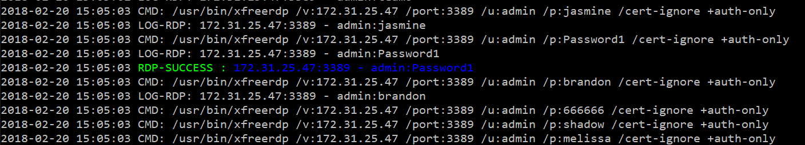

# Attacking EC2 via exposed ports

## Introduction

Amazon EC2 or Amazon Elastic Compute Cloud provides scalable computing capacity in the Amazon Web Services (AWS) cloud. Using Amazon EC2 eliminates your need to invest in hardware up front, so you can develop and deploy applications faster. You can use Amazon EC2 to launch as many or as few virtual servers as you need, configure security and networking, and manage storage. Amazon EC2 enables you to scale up or down to handle changes in requirements or spikes in popularity, reducing your need to forecast traffic.

Basically, Amazon EC2 instances

- are like virtual machines on the cloud
- you start a EC2 and you are given the choice of creating a key pair for ssh
- for Windows images, a RDP file or a password for the Administrator account is made available.
- you can choose to use a pre-created image for linux and Windows
- you can add the virtual machines in their own private networks using VPC
- you can allow access to certain ports and certain IPs using Security Groups

Attackers can target any of the aspects of an EC2 instance. This not only includes web applications, services etc. running on the instance but also the access to EC2 itself.

## What are we going to cover?

This chapter covers some of the attacks that can occur on an exposed EC2 machine on the Internet. 

## Steps to setup lab

Run the following script from the student VM to bring up the target lab

    deploy-compute-target

The output of this script is the IP address of the target EC2 which will be attacked

> If you see any error, please inform one of the trainers

## Steps to attack

- SSH into attacker EC2
- All attacks in this module will be run from the attacker EC2
- All target IPs are the internal IPs of the targets.

### Attack 1 - Service discovery on the target using Nmap

Nmap is one of the world's most widely used port scanning utilities. We can use it to discover the services exposed by the target EC2

Run the following commands to complete this exercise from the attacker machine. Please replace `TARGET-EC2-IP-ADDRESS` with the IP address from the output of the deploy command.

    sudo nmap -sS --script http-enum -v --top-ports 10000 -sV -g80 <TARGET-EC2-IP-ADDRESS>

Analyze the output and notice that there are two web applications running on this EC2.

### Attack 2 - Dictionary attack against SSH

Attacking SSH using hydra. Run this on the attacker machine.

    cd ~/tools/

    hydra -f -v -V -t20 -l ec2-user -P custom-rockyou.txt <TARGET-EC2-IP-ADDRESS> ssh

### Attack 3 - Dictionary attack against RDP (Demo)

**This is a demo. This machine is NOT created using the deploy-compute-target. We set this up during the in-person training.**

Just like an exposed SSH service can be attacked for Linux based distributions, misconfigured Windows machines exposing their Remote Desktop Port (TCP 3389) can also be attacked.

For example, May 2019's Patch Tuesday saw CVE-2019-0708 being patched which has been known to be exploited in the wild for Remote Code execution.

The SSH and RDP examples are used to highlight why an attack is possible given the following two conditions 

- Keeping an administration service open to the world (no network layer access control)
- misconfiguration or weakness within the service itself

The target Windows machine that is setup for this demo has been created using the free-tier but an additional user called `admin` has been added to showcase the attack. This user has a weak password.

`crowbar` is a python script that has a higher success rate in brute forcing RDP (along with supported services). The following command sets up `crowbar` to brute force a Windows machine using the username `admin` and a password list.

    python crowbar.py -b rdp -s ip-address/32 -u admin -C ../custom-rockyou.txt -v

**Note:** `crowbar`, although a very versatile tool to brute force logins, does not have a flag to stop the script when a match is found. As the script is written in python, this can be easily patched into the program.

## Addtional References

- [Nmap man page](https://linux.die.net/man/1/nmap)
- [SSH Dictionary attacks using Hydra](https://hackertarget.com/brute-forcing-passwords-with-ncrack-hydra-and-medusa/)
- [RDP Dictionary attack using hydra](http://romcheckfail.com/thc-hyrdra-remote-desktop-bruteforce-example-a-lesson-in-network-level-security/)
- [RDP Dictionary attack using crowbar](https://github.com/galkan/crowbar)
- [Microsoft RDP Remote Command Execution Vulnerability](https://portal.msrc.microsoft.com/en-US/security-guidance/advisory/CVE-2019-0708)