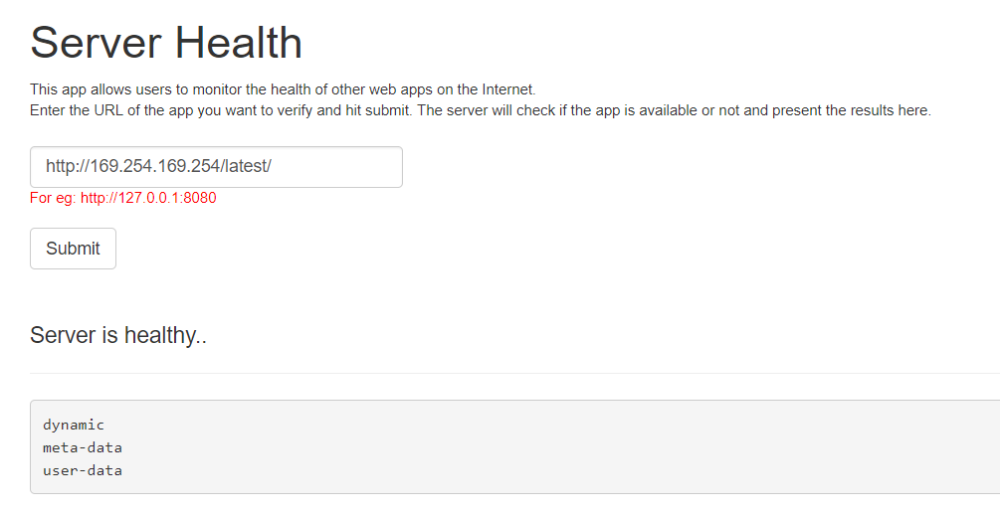

# EC2 Metadata abuse

## Introduction

EC2 Instance metadata is data about your instance that you can use to configure or manage the running instance. 

Although you can only access instance metadata and user data from within the instance itself, the data is not protected by cryptographic methods. Anyone who can access the instance can view its metadata. Therefore, you should take suitable precautions to protect sensitive data (such as long-lived encryption keys). You should not store sensitive data, such as passwords, as user data.

The EC2 meta data is accessible to any process running on the instance therefore any vulnerability that uses the server to make network requests can access information from the metadata endpoint

## What are we going to cover?

This chapter talks about a specific server side vulnerability that allows the user to control a web request that will be made by the server.

## Steps to attack

Browse to http://publicsite-unique-name.cloudsec.training:8000

This application is vulnerable to a Server Side Request Forgery (SSRF)

> A SSRF vulnerability occurs when an application uses user supplied data to make network requests from the webserver (or a different server behind the webserver). An attacker can request internal applications, services, non HTTP ports etc. and retreive information or perform port scans on internal machines or on the Internet.

This application is designed to show if the server health is okay or not. 

For example, passing `http://127.0.0.1` will fetch the index page of the site running on port 80 which tells us that the server health is okay.

However due to this app being vulnerable to SSRF, internal addresses can also be accessed. Specifically the instance metadata endpoint at `http://169.254.169.254`:

Try the following URLs

    http://169.254.169.254/latest/meta-data
    
    http://169.254.169.254/latest/meta-data/ami-id
    
    http://169.254.169.254/latest/meta-data/public-hostname
    
    http://169.254.169.254/latest/meta-data/public-keys/
    
    http://169.254.169.254/latest/meta-data/network/interfaces/

    http://169.254.169.254/latest/meta-data/local-ipv4

    http://169.254.169.254/latest/meta-data/public-keys/0/openssh-key/

If user meta-data is attached explicitly to the EC2 then this would be found at

    http://169.254.169.254/latest/user-data

    
## Additional references

- [Instance Metadata and User Data](https://docs.aws.amazon.com/AWSEC2/latest/UserGuide/ec2-instance-metadata.html)