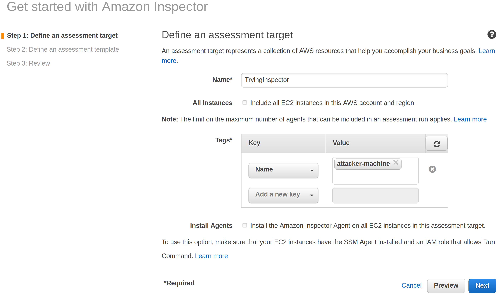
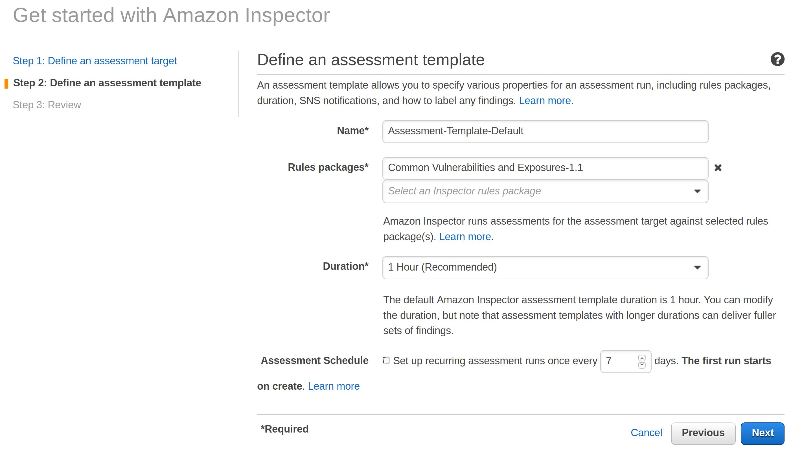

# AWS Inspector

## Introduction

Amazon Inspector is an automated security assessment service that helps improve the security and compliance of applications deployed on AWS. Amazon Inspector automatically assesses applications for vulnerabilities or deviations from best practices. After performing an assessment, Amazon Inspector produces a detailed list of security findings prioritized by level of severity. These findings can be reviewed directly or as part of detailed assessment reports which are available via the Amazon Inspector console or API.

## What are we going to cover?

This chapter will cover the AWS Inspector tool and the step by step guide on how we can run our own assessment on instances to discover vulnerabilities.

## Steps to attack/audit

As we are trying to learn the tool, we will use the cloudhacker machine as our target.

1. Navigate to AWS Inspector
2. Click on `Help me create an Assessment` to start the wizard
3. Click on `Advanced Setup`
4. In the `Define an assessment target` page, provide a name to the assessment
5. Uncheck `All Instances` checkbox and select `Name` from the Key dropdown and select `attacker-machine` from the Value dropdown
6. Uncheck `Install Agents` checkbox

7. In the `Define an assessment template` you can choose the Rules package that you would like to run on your targets. Select `Common Vulnerabilities and Exposures-1.1` and unselect the others for this hands-on exercise.
8. Select the duration remain for 1 Hour.
9. Uncheck `Assessment Schedule`

10. Click on `Next`. Before clicking on create, an AWS Inspector agent has to be added to the target machine.

11. The AWS Inspector agent can be installed on the targets by following the instructions at [https://docs.aws.amazon.com/console/inspector/install_agent](https://docs.aws.amazon.com/console/inspector/install_agent)
12. We will install the agent by downloading it on the cloud attacker machine
13. Run

```
wget https://inspector-agent.amazonaws.com/linux/latest/install
```

```
sudo bash install
```

14. Click `Create` to see the created assessment. The assessment will begin and you can view the report at the end of 1 hour.

## Additional references

- [AWS Inspector](https://console.aws.amazon.com/inspector/home)