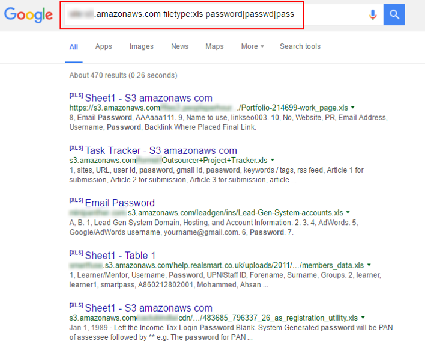

# Tools for finding public buckets

## Introduction

Due to the common mistakes that administrators and AWS users do, a lot of buckets get exposed to the Internet. In recent years, a lot of data has been revealed through open S3 buckets ranging from employee contracts, software code base, sensitive information like network diagram to usernames and passwords etc.

There are several tools to find and dump the contents of public buckets.

## What are we going to cover?

This chapter covers some popular tools that can be used find public buckets and dump data from within if required.

## AWS Buckets

The following is a list of valid S3 bucketnames on EC2

    1. https://bucketname.s3.eu-west-1.amazonaws.com/file.txt
    2. https://s3-eu-west-1.amazonaws.com/bucketname/file.txt
    3. https://bucketname.s3.amazonaws.com/file.txt
    4. https://s3.amazonaws.com/bucketname/file.txt 

### Google dorking

Google is an extremely powerful search engine that can be used to find specific resources on the Internet

For example, the following dork can be used to find S3 buckets containing excel sheets which in turn contain  potential passwords

    site:*.s3.amazonaws.com ext:xls | ext:xlsx | ext:csv password|passwd|pass user|username|uid|email

Other keywords can also be used to find other information

### Practice Exercise: DigiNinja Bucket Finder

Bucket finder is a ruby script that was written to work with discovering buckets with a provided dictionary.

    bucket_finder ~/tools/AWSBucketDump/BucketNames.txt -l results.txt

If you want to download the contents of the discovered buckets then specify -d to enable file downloads

    bucket_finder -d ~/tools/AWSBucketDump/BucketNames.txt -l results-download.txt

<!--
### Slurp

Slurp is a program written in go that uses certstream to search for S3 buckets

This tool simply listens to various certificate transparency logs (via certstream) and attempts to find public S3 buckets from permutations of the certificates domain name.

Certificate Transparency (CT) is an experimental Internet security standard and open source framework for monitoring and auditing digital certificates. The standard creates a system of public logs that seek to eventually record all certificates issued by publicly trusted certificate authorities, allowing efficient identification of mistakenly or maliciously issued certificates.

CertStream is a library for receiving certificate transparency list updates in real time from the CT log servers.

    slurp domain -t google.com

    slurp keyword -t admin,nullcon,example

-->

## Additional references

- [Bucket finder - DigiNinja](https://digi.ninja/projects/bucket_finder.php)
- [Enumerate S3 buckets via certstream](https://github.com/bbb31/slurp)
- [Bucket Stream](https://github.com/eth0izzle/bucket-stream)
- [Misconfigured bucket to system calls](https://speakerdeck.com/riyazwalikar/raining-shells-in-aws-by-chaining-vulnerabilities?slide=5)
