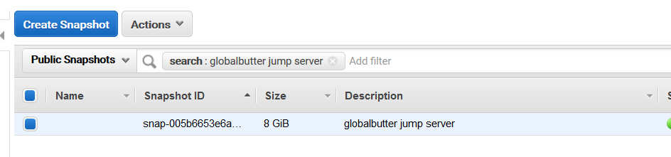

# Cloud Forensics for discovery and attacks

## Introduction

Carving deleted data, recovering lost files and examination of disk clusters can all reveal tell tale signs of malicious activity. On several occasions, the snapshots and volume available publicly have not been scrubbed for information and may reveal very interesting things about the system, including sensitive information.

## What are we going to cover?

This chapter is about doing digital forensic on an Amazon EC2 volume instance. We shall work with a snapshot that has been taken after an attack was performed on the original system. We will try and determine what commands were run by the attackers.

Forensic investigation requires that the target device on which the forensics will be performed should not be mounted as a filesystem to the analyst machine as that may cause the operating system to make changes to the sectors that may contain deleted data.

In this exercise, we will

- Discover a snapshot that has been made to conduct forensic investigation on
- Make a volume out of it
- Attach the volume to our attacker machine
- Use forensic tools to browse the filesystem without mounting the volume
- Identify what was the name and credentials of the database server to which the attacker connected

## Steps to attack

**You can do this exercise using the AWS Web console since the we did the last exercise using the command line**

Before performing moving on, we need to detach the volume from the previous exercise

First we will unmount the volume that we attached earlier

    sudo umount -l /mnt

Next, we will (forecfully) detach the volume from the attacker EC2

Use the AWS console to do this. 

1. Navigate to the EC2 service in AWS console
2. Select the attacker-machine
3. Scroll down the bottom pane to find `/dev/sdh` under Block devices
4. Click on `/dev/sdh` and select the EBS ID from the popup
5. In the new page that opens, select the EBS (if unselected) and click Actions > Force Detach Volume
6. Wait for about a minute and proceed after the State changes to 'available'

In the EC2 console, under Elastic Block Store > Snapshots, search for 'globalbutter jump server'

Obtain the snapshot id

    snap-005b6653e6a33d1e5

Obtain the availability zone and instance id of your attacker EC2 by running the command

    aws ec2 describe-instances --filters Name=tag:Name,Values=attacker-machine

Once the availability zone is obtained, insert it into the following command to create a new volume using the discovered snapshot

    aws ec2 create-volume --snapshot-id snap-005b6653e6a33d1e5 --availability-zone <ZONE-HERE>

Once the volume is created, note the 'VolumeID'

Next step is to attach the newly created volume to the EC2 attacker machine using the instance id of your attacker EC2 and the volume id of the newly created volume

    aws ec2 attach-volume --device /dev/sdh --instance-id <INSTANCE-ID> --volume-id <VOLUME-ID>

This may take some time. To check the status of the volume (it should say "in use")

    aws ec2 describe-volumes --filters Name=volume-id,Values=<VOLUME-ID>

Once the volume is attached, identify the partition using `lsblk`. The image will be `/dev/xvdh`. **Run the following commands on the attacker machine as that is where the volume has been attached using the AWS CLI**

    sudo lsblk

Using The Sleuth Kit (forensics framework) let's attempt to recover the files in `/home/ubuntu` directory

Check the filesystem on the image

    sudo mmls /dev/xvdh

Use the start sector address for the Linux partition to list folders

    sudo fls -o <OFFSET> /dev/xvdh

Get the inode number for the `home` directory

    sudo fls -o <OFFSET> /dev/xvdh <inode-home>

Once the inode number of the `ubuntu` directory is found get files using icat

    sudo fls -o <OFFSET> /dev/xvdh <inode-ubuntu>

use icat to recover the .bash_history file inside the `ubuntu` directory

    sudo icat -o <OFFSET> -r /dev/xvdh <inode-file-to-recover> > /tmp/bash_history

Examine the `bash_history` file to see what database server the attackers connected to and what credentials did they use.

## Additional references
- [Digital Forensic Analysis of AWS EC2](https://www.sans.org/reading-room/whitepapers/cloud/digital-forensic-analysis-amazon-linux-ec2-instances-38235)
- [Recovering deleted files using SleuthKit](https://possiblelossofprecision.net/?p=1216)
- [Sleuth Kit commands for computer forensics](https://rationallyparanoid.com/articles/sleuth-kit.html)