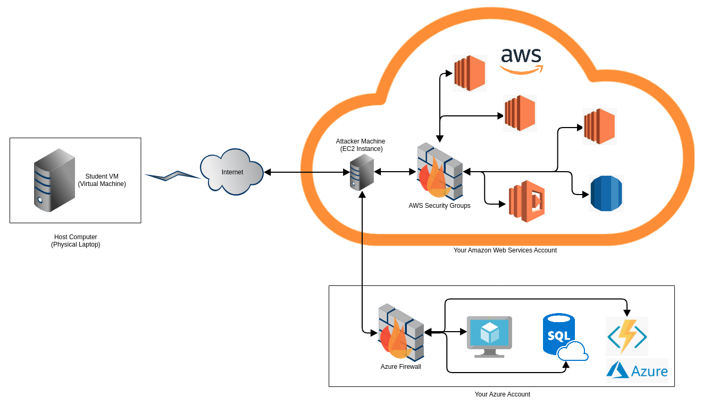

# The AWS and Azure network access for this training

Here's a diagram that shows how the entire network is laid out. Basically so far and when we run our setup commands during these 3 days,

1. Each one of you has your own virtual machine
2. Each one of you has your own attacker machine running inside your AWS
3. Each one of you have your own targets running in AWS and Azure that are not accessible to the Internet but are accessible only to your attacker machines
4. The S3 buckets that you will setup will be exposed to the Internet, but we will be using special names that cannot be guessed outside this training (more on this when we tackle the S3 scenario)
5. We will mention access to various targets if access is different than what is mentioned above

