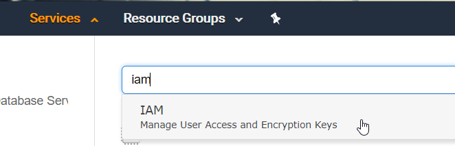
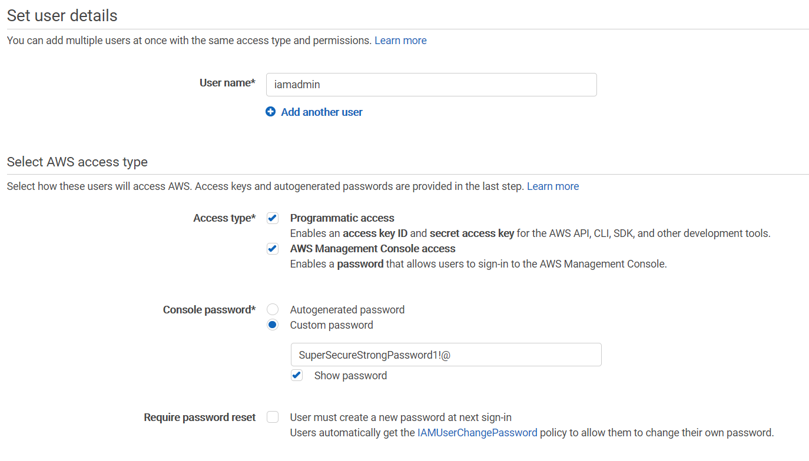
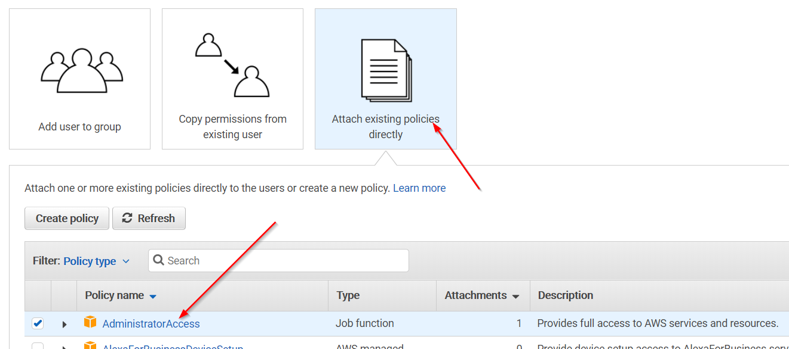
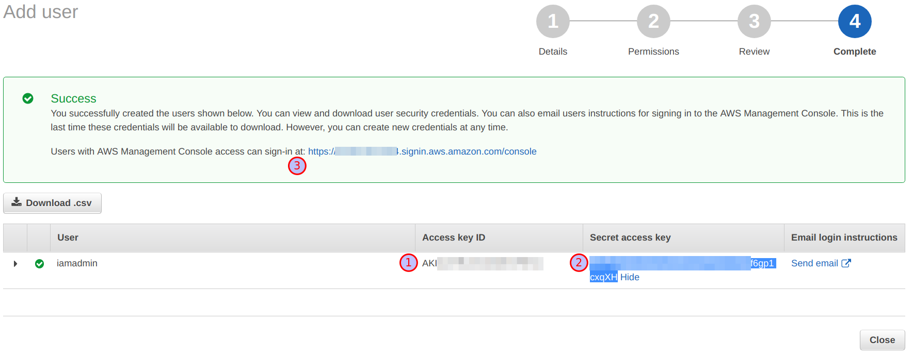

# Creating an IAM admin user

## Introduction

The primary AWS account, also called the root account, is very powerful in terms of access. To avoid losing its keys or secrets, we will create a IAM Administrator account which will have the same privileges as a AWS root account except for access to certain features like billing which we can anyways access using the root account.

## What are we going to cover?

In this chapter, we will create a IAM user with Administrator privileges that will be used throughout the rest of the class to create labs, attack targets and break stuff. 

## Steps to create an IAM user

Search for IAM in the services

Click on users > Add user

Create a user called 'iamadmin' with the following settings

AccessType: Programmatic access and AWS Management Console access

Console Password: Select Custom password

> Provide a strong alphanumeric character

Uncheck require password reset

> We are only asking you *uncheck require password reset* to do this for the purposes of the training

Click on 'Attach existing policies directly' and select 'AdministratorAccess'

Click Next and Create User

Copy and save the following in your text editor in the student VM

1. Access key ID
2. Secret access key
3. Unique sign in URL (Bookmark this link)

## Additional Information

- [Create IAM users](https://docs.aws.amazon.com/IAM/latest/UserGuide/id_users_create.html)