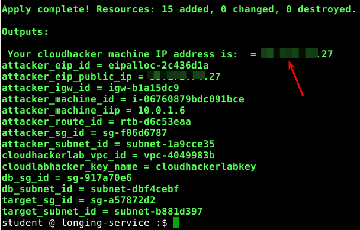
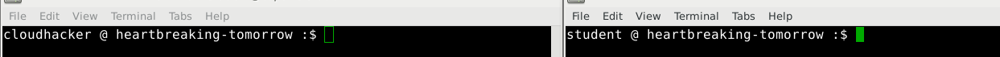

# Setting up and accessing the attacker VM

## Introduction

This training is all about attacking and breaking AWS and Azure assets. It would make sense that we attack our targets from our own IP addresses and not the training venue wireless. To do this, we will setup our own attacker machine in the cloud. Each one of us will have our own attacker machine with tools and access setup automatically.

This attacker machine is setup in an AWS Virtual Private Cloud (VPC) that allows connectivity to the target labs that you will setup over the next 3 days. This is where you will practice all your attacks. This setup allows you to perform attacks without worrying if your traffic is reaching an unauthorized server or not.

## What are we going to cover?

This chapter is about setting up the attacker machine. The machine will have our tools and access to the targets for the next 3 days.

### Setting up the attacker VM (EC2 instance)

This EC2 instance will be used to attack our targets over the next 3 days. This is hosted in your own account and has multiple tools that will be used during the training.

Multiple scripts will be used to setup the machine and access it.

#### ssh-checker

Before we deploy the attacker VM we need to ensure that your ssh keys are setup and added to the ssh-agent. Run the following two commands

    eval `ssh-agent -s`

    ssh-checker

To verify the command was successful, you can type the following

    ssh-add -l

You will notice an ssh key fingerprint with `/home/student/.ssh/id_rsa`

> If you don't see that message, please inform one of the trainers

#### deploy-cloudhacker

    deploy-cloudhacker

**Please Note: This script may take up to 10 minutes to complete**

This script will

* Use the stored credentials to deploy the `cloudhacker` machine in your AWS account
* If it is successful it will print the information to access the machine
* **Please save this information for later use**

> Otherwise, please inform one of the trainers

Note the "Your cloudhacker machine IP address". This is the machine you will be connecting to perform your attacks.

### How to login

Connect to the attacker EC2 VM using the key

    ssh -o ServerAliveInterval=15 -l cloudhacker <ipaddress-of-cloudhacker-machine>

Please type "yes" to the question

    Are you sure you want to continue connecting (yes/no)? yes

Run the following command in the SSH session to confirm your AWS cli access is configured properly on the attacker machine as well

    aws-cli-access-checker

**Please open another terminal window as well. At this point in the first terminal window you are logged into the cloudhacker VM and the newly opened terminal window is your student VM. You can differentiate between both the terminals by looking at the username in the bash prompt.**

## Additional information

No additional information for this section